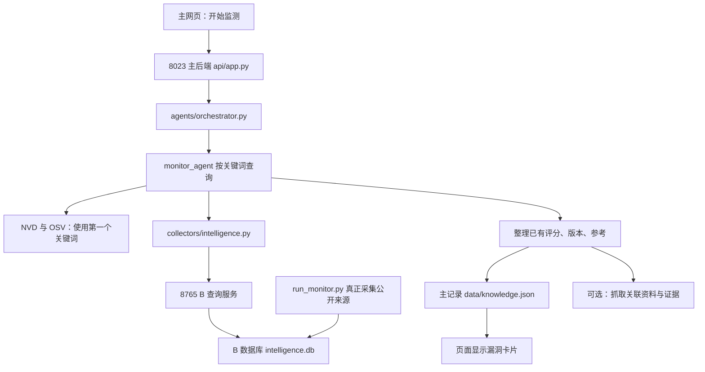
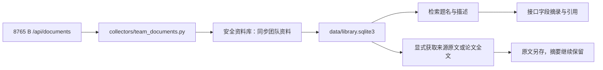

# ai-sec-intel：全部文件用途与系统运行说明

核对日期：**2026 年 10 月 10 日（北京时间）**。仓库：[sijunxiaodeng/ai-sec-intel](https://github.com/sijunxiaodeng/ai-sec-intel)。本说明依据 `main` 的 **d261b21** 源码、真实导入关系、HTTP 路由、容器与脚本配置整理，覆盖该版本 **242 个跟踪文件**，每个文件都有用途记录；另补充本轮 B 云端修改的 **4 个新增程序／测试文件**。242 是固定源码基线的文件数。本轮 B 修复提交为 `7568880`，已同步到 main `52c2733`；加上 4 个新程序／测试和本说明，main 共 247 个跟踪文件。

你可以先读前面的运行解释，再按文件名查后半部分。基线源码链接固定在核对提交；本轮新增文件与修改说明链接固定在 B 修复提交 `7568880`。旧的 2026 年 10 月 9 日说明对应早期 227 文件合并清单，不能继续当当前版使用。仓库里面的历史验收结果仍保留各自日期，没有更改其成绩或来源记录。

## 先理解现在的分支

| 分支 | 本次核对提交 | 跟踪文件数 | 用途 |
| --- | --- | ---: | --- |
| main | 52c2733 | 247 | GitHub 默认看到的完整集成版，已包含主网页、B 模块、C 资料与问答、一键演示和云端部署文件。 |
| dev | 26ce339 | 242 | 三人日常集成开发线；团队约定先在这里整合，再晋升 main。 |
| feat/intelligence | 7568880 | 124 | 你的 B 工作分支；当前 GitHub 云端定时采集实际读取这个分支。 |
| automation/intelligence-bootstrap-20261009 | e00c1c8 | 2 | 首次迁移的公开情报数据库快照和说明，不是第二套应用源码。 |

**现在 main 已合入 A/B/C 的完整文件，不用再为了看到 C 新功能切到旧 dev。** 原源码基线包含 242 个路径，本轮同步后 main 已包含新增的 4 个程序／测试和本说明，共 247 个路径；同名文件存在不表示各分支的内容完全一样。`main.py` 是启动文件，`main` 是 Git 分支，两者不同。

## 用一句话理解系统

这是“收集 AI 安全资料 → 存到数据库 → 补充可引用的证据 → 在网页展示或回答问题”的系统。

A 提供网页、主接口和调用顺序；B 收集公开情报、按 CVE 合并、判断 AI 相关性，并提供只读查询；C 整理漏洞与通用资料、检索证据、组织问答、检查引用和管理关系候选。`agents/` 中的角色主要由固定 Python 函数组成，名称带 Agent 并不表示每个角色都是独立的大模型或会自主制定计划。

| 程序 | 默认位置 | 做什么 |
| --- | --- | --- |
| 根目录 `main.py` | http://127.0.0.1:8023 | 主网页和主后端；后台六小时线程依附这个进程。 |
| `intelligence/run_intelligence_api_v6.py` | http://127.0.0.1:8765 | 查询 B 已有数据库，供主系统读；它本身不采集公网资料。 |
| `intelligence/run_monitor.py` | 本机或 GitHub 服务器 | B 多源采集、存储、融合和可选分类；默认循环，`--once` 只跑一轮。 |
| `.github/workflows/intelligence-collect.yml` | GitHub Actions | 个人电脑关机后仍在云端跑 B 单轮采集，并保存下一轮需要的状态。 |
| `scripts/demo-up.sh` | 支持 Bash 的本机 | 一起启动主应用与 B API；优先 Docker，缺 Docker 时用两个本地进程。 |

`127.0.0.1` 表示运行程序的这台机器。手动只执行 `python main.py`，不会同时启动 B 的查询服务。源码设计用两个 Python 环境，因为主系统与 B 的依赖版本不同；Docker 也用两个镜像，不能把两份依赖随便混装到同一环境。

## 点“开始监测”后发生什么



真实调用是：`web/app.js` → `POST /api/collect` → `api/app.py` → `agents.orchestrator.run_collect` → `monitor_agent` → NVD、OSV、B 团队 HTTP 接口 → `enrichment_agent` → `database/store.py` 保存。B 团队接口默认只返回已判 AI 相关、且有 CVE 的记录；主界面的这个按钮**读取 B 已经采好的数据，不是让 B 立即重采全部 11 个来源**。

网页现在默认填写 `llm,vllm,langchain,huggingface,openai,ollama,jailbreak`。NVD/OSV 用第一个词，B 最多查前八个词，再按编号去重。某个来源失败，其他来源继续，步骤区会显示失败原因。

采集后是否自动抓关联网页由 `AUTO_INGEST_ON_COLLECT` 控制：**Python 代码默认 `1`（开启），一键演示／Docker 默认 `0`（关闭）**。开启时自动处理本批前 3 条，每条最多 4 个来源；关闭时仍可在“情报富化”选择具体 CVE 手动抓取。“查询 EPSS、KEV 与论文”是另一操作，用于补充利用概率、已被利用目录与明确提及对应编号的论文。

首次干净启动可能从仓库 `cards.json` 导入历史卡片；当前固定快照有 28 条。看到列表或编号，不表示刚刚采集了真实最新数据。

## B 没有 CVE 的文章现在怎样进网页

最新 main 已把这条链接通：



进入“安全资料库”点“同步团队资料”，会导入 B 接口的**题名、描述和来源元数据**。默认处理最近更新的 30 条，最多 200 条，显示窗口外剩余数量；不是全量历史镜像，也不会因为一轮没有看到某条就判其被撤回。

这里引用的是队友 API 的真实字段快照，标记 `team_summary`，回答显示“接口字段摘录，非原始全文”。纯团队摘要回答不调用聊天模型。博客／公告可再点“获取来源原文”，arXiv 摘要可点“获取论文全文”，原文成功后是独立资料，摘要不会被覆盖。标准和政策的接口描述不能直接当完整标准条款或正式政策正文，原有固定官方资料同步仍单独保留。

**接入代码已经存在；实际页面有无新资料，还取决于 B 服务可达且库里有资料。** d261b21 的 `sync_team` 默认显式使用 localhost，覆盖了容器内 `TEAM_INTEL_BASE_URL=http://b-api:8765`：同机手动运行可按默认地址连接，Docker 的团队资料同步还需修正这个地址衔接。不能仅凭一键脚本存在就宣称 Compose 的整条链已验证成功。

本轮还对固定 main `d261b21` 做了新的 **questions 离线测试：272 项，271 通过、1 失败，0 error、0 skip**。失败在 [questions/test_team_documents.py 第 173 行](https://github.com/sijunxiaodeng/ai-sec-intel/blob/d261b21ba4d914a40d6675203e59d098af8f0800/questions/test_team_documents.py#L173)：测试期待拒绝 `http://localhost`，当前构造函数却允许省略端口。这次验证禁止公网 socket、替换后台启动并使用临时关系库，没有运行真实采集／聊天模型，也没有修改 A/C 源文件或真实数据库。它确认一个集成测试与实现不一致的问题，不能写成 main 所有测试通过，也不能据此判断独立准确率或云端六小时时效。

## 你的 B 采集模块在做什么

`run_monitor.py` 像闹钟；`source_registry.py` 是来源名单；`multisource.py` 安排并行任务；`run_source.py` 处理单个来源。

1. 读取配置中的 **11 个来源、8 类内容**，按增量窗口、官方接口、RSS／Atom或固定官方页面读取候选。
2. 有 CVE 的记录进入 SQLite 来源表，并按 CVE 融合成统一漏洞；无 CVE 的文章、社区、论文、标准等进入文档表。
3. V5 分类先用规则判断 AI 相关性，模糊项在启用模型且调用预算允许时才发给模型。main 基线的 Actions 与本地示例配置默认模型预算为 `0`。本轮云端修改保留采集阶段的 `0` 预算，另加采集之后独立的 DeepSeek 复核阶段，每轮最多两次；两段不是同一个预算。
4. 保存原始首次入库时间、增量游标、观察基线、HTTP 缓存和分类结果，下轮续采。
5. 独立的 B API 只读这些数据；主应用通过 HTTP 读取 CVE，通用资料通过“同步团队资料”读取。

旧 `run_monitor_once.py`／V2、V4 是兼容或较早入口；正常启动不用把所有 `run_*.py` 挨个执行。部分旧工具仍被新版复用，不应只根据名字删除。

## 问答怎样得到答案

RAG 就是“先在资料库找证据，再依据证据回答”，不是另一个大模型：


具体漏洞问题走 `conversation.py` → `qa_agent.py` → `rag/retrieve.py` → 引用／字段检查 → `verifier_agent.py`。模型输出无效、引用错字段、编号或分数不符、关键内容遗漏时通常回退有引用的证据摘录；最终外层核对失败会加核对警告。连续追问只承接已确定的漏洞范围，每轮重新检索，旧助手回答不作为新的证据。

资料问答另走 `library_qa.py`：对论文／政策／文章原文，模型只能选择已有段落编号，程序展示原文和引用。关系分析另走 `relations_qa.py`：当前两个主题是“间接提示注入”和“模型供应链”，使用已核对固定前提与有限分析路径；模型只选择路径。新文章可以提候选并审核成补充图，不会自动获得通用多跳因果推理能力。

| 名词 | 作用 |
| --- | --- |
| BM25 | 关键词检索算法；找资料用，不需聊天模型密钥。 |
| BGE | 可选语义检索模型，把文字变成向量，辅助召回；要显式准备本机模型与索引。 |
| DeepSeek / Qwen | 聊天模型，组织漏洞回答或选择段落／路径；与 BGE 不同。 |
| `models.py` | 定义程序之间交换的字段格式；不是模型权重。 |
| `config/llm.py` | 主系统实际发送聊天模型请求的代码。 |

主系统聊天模型配置在 `config/local.json`，网页“模型设置”保存；B 的本地可选语义分类配置在 `intelligence/.env`。本轮 GitHub 云端复核使用仓库 Secret `DEEPSEEK_API_KEY`，默认模型 `deepseek-chat`，可用仓库变量 `DEEPSEEK_MODEL` 选择账户支持的 DeepSeek 型号。网页设置、本地 B 配置、GitHub Secret 分别管理，克隆源码不附带别人的密钥、聊天模型或已下载的 BGE 模型。

## 数据放在哪里

| 路径 | 内容 |
| --- | --- |
| `data/knowledge.json` | 主系统漏洞和基本富化记录。 |
| `data/task_c.sqlite3` | 具体 CVE 原文、来源快照、证据片段与可选向量。 |
| `data/library.sqlite3` | 通用论文、博客、政策等，包含新接入的团队字段摘要与另存原文。 |
| `data/assets.sqlite3` | 用户自报的组件资产清单。 |
| `data/library_relations.sqlite3` | 关系候选、复核、撤销历史。 |
| `intelligence/data/intelligence.db` | B 的来源、融合漏洞、非 CVE 文档、游标、缓存、分类。 |
| `data/runs.json`、`data/monitor.json` | 主流程步骤和本机后台状态。 |
| `intelligence/data/monitoring_status.json` | B 最近一轮总状态与逐源结果。 |
| `intelligence/data/monitoring_baseline.json` | B 首次观察基线，用于时效统计。 |
| `intelligence/data/classification_status.json` | B 最近分类批次状态。 |
| `config/local.json`、`intelligence/.env` | 本机模型、密钥、参数。 |
| `.venv/`、`intelligence/.venv/` | 两个独立 Python 环境。 |
| `.demo/` | 一键演示的PID、日志、健康与同步检查结果。 |

运行数据被 Git 忽略，GitHub 看不到很正常。`database/`、`storage/` 是读写数据的源码目录；实际数据在 `data/`。两模块数据库不会因为在同一 Git 仓库就自动同步。

Docker 的 `main-data` 与 `b-data` 是两份独立卷；容器里均显示 `/app/data`，但不是同一个共享数据库。根 Compose 会用 `b-seed --force` 初始化专门的**合成演示卷**；`seed_demo_db.py --force` 也会删除重建指定库，别用真实采集库做演示种子的目标。合成 `CVE-2099-90001` 等和虚构来源标签只用于联调，不能证明真实多源覆盖或六小时时效。

## 关机之后哪里仍运行

GitHub Actions：读取 main 的任务配置 → 拉 `feat/intelligence` 采集代码 → 恢复上轮 artifact → B 单轮采集和规则分类（模型预算 0）→ 本轮新增的可选独立 DeepSeek 复核 → 记录当轮时效／分类／模型事实 → 一致性 SQLite 备份 → 上传新 artifact → 留最近八份。

定时是每小时第 7、22、37、52 分钟（UTC），相邻间隔 15 分钟，北京时间分钟值相同。调度可能排队或延迟，所以 **15 分钟配置不等于所有漏洞都已小于六小时入库**，来源故障、未知发布时间和超限样本要分别看真实统计。

个人电脑关机不会停止 GitHub 采集；它没有常驻 8023 主网页或 8765 查询 API。你的本机／Docker 服务在运行它的机器关机时仍会停止。云端 artifact 不会自动落入本机 B 库，要按[状态恢复说明](https://github.com/sijunxiaodeng/ai-sec-intel/blob/d261b21ba4d914a40d6675203e59d098af8f0800/intelligence/deployment/ACTIONS.md)下载、校验并恢复，再让 B API 查询；主网页还需要采集导入 CVE或点击“同步团队资料”导入摘要。

最新 main 与 dev 已含 `intelligence/deployment/`，不用再从 B 分支补一个缺失脚本。恢复前停止该库写入并按说明备份、恢复到空目录，保留历史首次时间，不能重置数据库来消除超限记录。

## 本轮实际云端验证

首次新版本运行：[38034184671](https://github.com/sijunxiaodeng/ai-sec-intel/actions/runs/38034184671)，北京时间 **2026 年 10 月 10 日 15:22:06** 启动。运行实际读取 B `7568880`，采集、快照上传和整体任务成功。以下数字来自该运行的 `B cloud facts`，不是本机数据库，也不是合成演示。

| 项目 | 实测结果 |
| --- | --- |
| 原观察期去重精确 CVE | 735 条，222 条延迟 ≥6 小时。 |
| 首次云端上线后新发布、且首次入库也在上线后的精确 CVE | 308 条，12 条延迟 ≥6 小时。 |
| 最近 24 小时精确 CVE | 412 条，12 条延迟 ≥6 小时。 |
| DeepSeek 实际执行 | `skipped`，原因 `missing_api_key`，尝试 0 次、校验通过 0 次、落库 0 条。 |
| 当前来源状态 | 1 个失败、2 个 partial，未知 0；partial 还需结合近期发布和历史回填字段判断。 |
| 本轮与上一完成运行的创建间隔 | 19,539 秒，即 5 小时 25 分 39 秒；本轮是手动触发，不能冒充定时频率。 |

**当前严格六小时时效仍未通过，模型实际调用也尚未验证成功。** 代码已经接入，但当前工作流拿不到 `DEEPSEEK_API_KEY`；用户曾确认已设置，需要核对它是否位于**本仓库 Actions 的 Repository secrets**。Environment secret 还需要绑定对应 Environment，Variables、本机 `.env` 或其他仓库的同名字段都不会自动注入此任务。无需在聊天或源码中提供密钥。

原历史 210 条超限没有被抹去；新云端统计额外出现 12 条超限。开启模型不能改变“发布到首次采集”的时间。已观察的定时运行也曾间隔 3～4 个多小时，配置 15 分钟不足以保证严格 SLA；需要继续改善来源采集并使用足够稳定的持续调度。不要通过删库、换基线或忽略旧数据来宣布达标。

## 本轮补上的云端模型与事实报告

这次在已有 B 采集后面加了两个独立步骤：[DeepSeek 复核](https://github.com/sijunxiaodeng/ai-sec-intel/blob/756888025190e0aebf1543aab67c2725a599c3e0/intelligence/deployment/deepseek_review.py)和[当轮事实报告](https://github.com/sijunxiaodeng/ai-sec-intel/blob/756888025190e0aebf1543aab67c2725a599c3e0/intelligence/deployment/actions_report.py)。源数据先入库，规则能确定的先完成分类；模糊 CVE 留在 `pending_llm` 队列，再由独立复核尝试处理。它不会把每一篇博客、论文或标准都送给模型，也不会重复调用已经由规则确定的记录。

仓库已配置 `DEEPSEEK_API_KEY` 时，定时任务默认启用这一步；缺少 Secret 时写明 `missing_api_key` 并继续采集备份。手动 **Run workflow** 可取消 `deepseek_review`，只关闭本轮模型复核。密钥只注入模型步骤，不注入采集步骤；模型请求固定发向 DeepSeek 官方 HTTPS 接口，每轮最多 **2 次**，每次请求超时 **20 秒**，整个模型子进程组有 **60 秒**硬截止。模型错误、超时或分类锁被占用，会留下类别化状态，已有采集数据和已提交的分类仍可备份。

`deepseek_status.json` 分别记录请求尝试数、通过响应校验的数、已提交分类数和失败类别，不保存密钥或模型原始响应。`actions_report.json` 读取当前数据库并写入当轮事实，之后一起进入状态快照；Summary 和 notice 使用经筛选的状态及数字。旧快照里的模型结果必须匹配当前 `run_id` 才能作为本轮证据；否则显示未执行／旧记录，不把上次成功冒充本次成功。

| 时效统计视角 | 实际范围 | 怎样理解 |
| --- | --- | --- |
| 原始全观察期 | 沿用 `monitoring_baseline.json` 的原始观察起点；统计起点之后发布且首次入库的精确 CVE 样本。 | 保留原来超限、未知时间和历史观察口径，不通过迁移或重置数据库消除问题；历史回填另有原指标。 |
| 首次云端部署后 | 用单独的 `CLOUD_COLLECTION_STARTED_AT` 起点计算附加子集；当前配置为 `2026-10-09T12:05:16Z`。 | 用来观察迁移后变化，不覆盖原观察基线，也不把旧超限改成合格。 |
| 最近 24 小时 | 以报告时间减 24 小时，统计这段时间后发布且首次入库的样本。 | 这是滚动子集，样本少或没有样本时不能据此认定已经达标。 |

三项按去重的 CVE 计算“来源发布时间 → 首次实际入库”，**严格小于 6 小时**，恰好 6 小时也计超限。缺少精确时间、负延迟、异常或未来时间单独排除或记未知；来源记录／文档覆盖还会包含重复 CVE、文章和论文，所以它的延迟记录数不能直接当作独立 CVE 超限数。模型分类队列的等待与响应时间是另一件事，模型失败本身不等于采集迟于六小时。

报告另列当前内容哈希／分类器版本仍匹配的规则完成、语义结果、`review`、`pending_llm`、`retry` 和过期／未分类数量；规则完成不能当作已调用 DeepSeek。NVD／GitHub 的 `partial` 如果同时标明近期发布采集成功、历史回填仍待处理，说明是回填尚未结束，要与本轮近期采集失败区分。

调度元数据可用时，报告列出实际两轮创建间隔、启动间隔和排队时间，并区分手动运行与定时事件；不可用时记未知，**不会用配置的 15 分钟代替实测间隔**。本轮新增逻辑已按源码核对，本文不宣称已经成功调用真实云端模型，也不宣称六小时时效或赛题全部指标已通过。最新实际状态应查看对应 Actions 运行的 Summary、notice 和状态快照。

## 初学者怎样启动

先区分用途：**真实数据使用已有／云端恢复的 B 库；演示环境可生成合成种子。** 本文是文件与调用解释，本次核对没有替你重新运行公网采集、LLM、Docker或一键脚本，也没有把历史验证数字改写成新的成功成绩。

### Windows 手动启动真实服务

从 main 克隆后分别建两套环境。在根目录 PowerShell：

```powershell
git clone --branch main https://github.com/sijunxiaodeng/ai-sec-intel.git ai-sec-intel-demo
cd ai-sec-intel-demo
python -m venv .venv
.\.venv\Scripts\python.exe -m pip install -r requirements.txt
```

B 用自己的环境。已有数据先核对位置；若要恢复云端快照，先按部署说明恢复，再启动只读 API：

```powershell
Push-Location intelligence
python -m venv .venv
.\.venv\Scripts\python.exe -m pip install -r requirements.lock.txt
.\.venv\Scripts\python.exe run_intelligence_api_v6.py
```

保持该终端运行。另开终端回到仓库根目录启动主网页：

```powershell
$env:TEAM_INTEL_BASE_URL='http://127.0.0.1:8765'
$env:AUTO_INGEST_ON_COLLECT='0'
.\.venv\Scripts\python.exe main.py
```

打开 http://127.0.0.1:8023 。先在总览确认团队服务可达，再点“开始监测”读取 CVE、到“安全资料库”点“同步团队资料”。如果 B 没有数据库，API可启动但无有效数据；可以恢复真实云端快照，或在独立演示目录生成种子。想在本机真实采一轮，另运行 B 的 `run_monitor.py --once`，并核对每个来源状态，不必把它当 API 的必需重复启动步骤。

### Bash 一键演示

Linux／WSL 等支持 Bash、Python3、curl、timeout 的环境可参考：

```bash
./scripts/demo-up.sh
./scripts/demo-smoke.sh
```

前者尝试 Docker／本地回退，并尝试公网采集和资料同步；后者会实际请求 collect/enrich/ask，会写数据，已配置聊天模型时可能产生模型调用。它们不是单纯打开页面的无副作用检查。

只需无公网 B 采集的本地演示时可用 `DEMO_MODE=local DEMO_B_MONITOR=0 ./scripts/demo-up.sh`；注意公开资料同步仍可联网，如也要跳过，可同时设 `DEMO_LIBRARY_SYNC=0`。停止参考 `demo-down.sh`，其端口清理会停止 8023／8765 上的进程，使用前确认属于你的演示服务。脚本部分失败会保留现有／合成数据并继续，必须读 `.demo/collect-last/summary.json` 和各日志，不能把脚本退出 `0` 当全来源成功。

可选 `python -m rag.prepare` 加载人工历史样例，`--semantic` 才准备 BGE。测试、评测、验收题单是开发工具，启动不需要逐个运行；题单有冻结基线，旧轮题单不能直接对新代码当正式验收。

## 文件扩展名怎样理解

- `.py`：Python 逻辑；入口负责启动，内部模块被调用。
- `.html`／`.js`／`.css`：页面结构、交互、样式。
- `.json`：数据格式、样例、关系注册表、题单或历史结果，具体看用途。
- `.md`／`.docx`：说明文档；历史章节不是可执行步骤。
- `.yml`：容器或云端任务配置。
- `requirements*.txt`：安装包清单；两套环境分别安装。
- `__init__.py`：包标识；两个 `_init_.py` 是空的误拼文件。
- `test_*.py`：开发行为测试，不会在你打开页面时挨个执行。

旧说明的“未接入非 CVE”判断已经被第二十一步更新；“双击 page.html 看静态卡片”等描述也属于历史。下面逐文件说明以此固定 main 源码为准。

## main 基线 242 个文件逐项说明

M=main，D=dev，B=feat/intelligence。所在分支仅表示该路径存在；本节用途和链接依据 main 固定提交，本轮修改另见后文新增文件及云端说明。点击名称即可到 GitHub 看源文件。


### 根目录：启动、依赖、容器和阅读文档

| 文件（所在分支） | 用途 | 实际行为与边界 |
| --- | --- | --- |
| [.dockerignore](https://github.com/sijunxiaodeng/ai-sec-intel/blob/d261b21ba4d914a40d6675203e59d098af8f0800/.dockerignore)（M, D） | 配置：控制根主应用构建 Docker 镜像时排除本机数据、环境、日志和密钥。 | 排除.git、.venv、data/、intelligence/data、.env、config/local.json、.demo等，避免把实际数据库/配置打包进镜像；intelligence子镜像另有自己的.dockerignore。 |
| [.gitignore](https://github.com/sijunxiaodeng/ai-sec-intel/blob/d261b21ba4d914a40d6675203e59d098af8f0800/.gitignore)（M, D, B） | 配置：规定Git不要上传哪些本地文件，如数据库、虚拟环境、日志和真实密钥。 | 排除主data/、config/local.json、虚拟环境、日志，现也排除一键演示的.demo/日志、PID与状态；不是程序业务逻辑。B另有intelligence/.gitignore。 |
| [Dockerfile](https://github.com/sijunxiaodeng/ai-sec-intel/blob/d261b21ba4d914a40d6675203e59d098af8f0800/Dockerfile)（M, D） | 配置：把主网页和A/C后端打包成独立 Docker 容器。 | Python3.12 slim安装根requirements，以非root UID10002运行main.py；容器内8023/0.0.0.0，TEAM_INTEL_BASE_URL=b-api，AUTO_INGEST_ON_COLLECT=0。不把B与Pydantic2依赖装进同一主环境，不提供云端Actions常驻网页。 |
| [INTEGRATION.md](https://github.com/sijunxiaodeng/ai-sec-intel/blob/d261b21ba4d914a40d6675203e59d098af8f0800/INTEGRATION.md)（M, D） | 文档：告诉三人集成分支、文件职责、端口和一键启动方法。 | A维护整合约定：dev集成再晋升main；8023主应用+8765 BAPI，Docker优先/本地双进程回退，demo-up含demo-collect、合成种子、env表和职责。内容是团队规范与操作说明，不是代码已经真实成功的证明。 |
| [Makefile](https://github.com/sijunxiaodeng/ai-sec-intel/blob/d261b21ba4d914a40d6675203e59d098af8f0800/Makefile)（M, D） | 可选入口：给一键演示脚本提供简短命令别名。 | make demo-up/down/smoke/collect分别调用对应scripts；make demo先启动再smoke。它本身不实现采集或问答，仍需Bash和相关依赖。 |
| [README.md](https://github.com/sijunxiaodeng/ai-sec-intel/blob/d261b21ba4d914a40d6675203e59d098af8f0800/README.md)（M, D, B） | 文档：项目总说明：介绍打开网页、采集、富化、问答和逐步开发成果。 | 最新main已合入A/B/C与一键演示入口，推荐demo-up/demo-smoke，手动主入口仍python main.py。第一步至第二十一步是开发历史，并非启动时都要执行；历史测试数/数据数保留各自日期。 |
| [cards.js](https://github.com/sijunxiaodeng/ai-sec-intel/blob/d261b21ba4d914a40d6675203e59d098af8f0800/cards.js)（M, D, B） | 兼容旧入口：把 cards.json 包成浏览器能读取的 window.CARDS 变量。 | 当前内容与 cards.json 相同，仍由 database/store.py 兼容导出；但当前 web/index.html 与 page.html 都没有加载它，主网页通过 /api/items 读取数据。 |
| [cards.json](https://github.com/sijunxiaodeng/ai-sec-intel/blob/d261b21ba4d914a40d6675203e59d098af8f0800/cards.json)（M, D, B） | 演示：存放可兼容读取的简单漏洞卡片快照。 | 此main快照仍有28张历史卡片；没有本机data/knowledge.json时，database/store.py导入作为起始数据。保存主知识库时兼容导出，不是B SQLite全量情报库；合成演示库另由seed_demo_db生成。 |
| [collect_nvd.py](https://github.com/sijunxiaodeng/ai-sec-intel/blob/d261b21ba4d914a40d6675203e59d098af8f0800/collect_nvd.py)（M, D, B） | 兼容旧入口：保留早期一键采集的命令行入口。 | 默认关键词 ollama，经根 orchestrator 调用当前采集流程，打印少量结果。名字和双击 page.html 的提示较旧；当前页面仍需 python main.py。 |
| [docker-compose.yml](https://github.com/sijunxiaodeng/ai-sec-intel/blob/d261b21ba4d914a40d6675203e59d098af8f0800/docker-compose.yml)（M, D） | 配置：一起启动 B 演示种子、只读 API 和主网页服务。 | b-seed用seed_demo_db --force重建独立b-data卷的合成库；b-api 8765健康后main-app 8023启动，端口仅宿主127.0.0.1，main-data/b-data分卷，restart unless-stopped。默认autoingest0。Compose只在该机器运行，关机停止；团队摘要sync当前需修正sync_team默认基址覆盖问题。 |
| [main.py](https://github.com/sijunxiaodeng/ai-sec-intel/blob/d261b21ba4d914a40d6675203e59d098af8f0800/main.py)（M, D, B） | 当前入口：启动大家在浏览器中使用的主系统。 | 切工作目录到仓库根，用Uvicorn加载api.app:app；监听APP_HOST（默认127.0.0.1）与APP_PORT（默认8023），Docker容器设0.0.0.0。手动只启动主应用，不自动启动B API；一键脚本负责分别启动。 |
| [models.py](https://github.com/sijunxiaodeng/ai-sec-intel/blob/d261b21ba4d914a40d6675203e59d098af8f0800/models.py)（M, D, B） | 实际调用：统一三人交换的情报字段，避免各模块数据格式不一致。 | normalize 整理简单卡片；intelligence_item 构造 IntelligenceItem；enriched_record 构造带 CVSS、EPSS、KEV、PoC、论文的 EnrichedIntelligence。缺值保留空，兼容旧数据；这不是机器学习模型文件。 |
| [orchestrator.py](https://github.com/sijunxiaodeng/ai-sec-intel/blob/d261b21ba4d914a40d6675203e59d098af8f0800/orchestrator.py)（M, D, B） | 兼容旧入口：把旧命令行采集脚本转接到现在的主系统工作流。 | collect_nvd.py 导入本文件；collect_and_save 实际调用 agents.orchestrator.run_collect，再从主知识库提取编号和分数。它不是网页的总编排器，也已经不只采 NVD。 |
| [page.html](https://github.com/sijunxiaodeng/ai-sec-intel/blob/d261b21ba4d914a40d6675203e59d098af8f0800/page.html)（M, D, B） | 兼容旧入口：告诉双击网页文件的人如何启动真正的系统。 | 目前只是 21 行启动提示页，显示 python main.py 和 http://127.0.0.1:8023 链接，没有卡片列表或问答逻辑。 |
| [requirements-rag.txt](https://github.com/sijunxiaodeng/ai-sec-intel/blob/d261b21ba4d914a40d6675203e59d098af8f0800/requirements-rag.txt)（M, D） | 配置：在主系统依赖基础上增加本地中文向量检索依赖。 | 包含 -r requirements.txt 和 fastembed==0.9.0；向量模型还需单独准备，安装这个文件本身不代表索引已经存在。 |
| [requirements-test.txt](https://github.com/sijunxiaodeng/ai-sec-intel/blob/d261b21ba4d914a40d6675203e59d098af8f0800/requirements-test.txt)（M, D） | 配置：在主系统依赖基础上增加 HTTP 接口测试依赖。 | 包含 -r requirements.txt 和 httpx==0.24.1，主要给 questions 中的离线与接口测试使用；不负责定时采集。 |
| [requirements.txt](https://github.com/sijunxiaodeng/ai-sec-intel/blob/d261b21ba4d914a40d6675203e59d098af8f0800/requirements.txt)（M, D, B） | 配置：列出主系统启动、网页接口和正文提取所需的 Python 软件包。 | 锁定 FastAPI、Pydantic、Uvicorn、Starlette、trafilatura、pypdf；没有前端 npm 构建。安装本文件即可使用基础网页与词法检索。 |
| [store.py](https://github.com/sijunxiaodeng/ai-sec-intel/blob/d261b21ba4d914a40d6675203e59d098af8f0800/store.py)（M, D, B） | 兼容旧入口：保留早期简单卡片的读取、保存、合并和搜索函数。 | 只处理根目录 cards.json/cards.js；当前 main.py→api.app→agents.orchestrator 链没有导入它，实际主知识库由 database/store.py 管理。 |
| [全文与政策资料说明.md](https://github.com/sijunxiaodeng/ai-sec-intel/blob/d261b21ba4d914a40d6675203e59d098af8f0800/%E5%85%A8%E6%96%87%E4%B8%8E%E6%94%BF%E7%AD%96%E8%B5%84%E6%96%99%E8%AF%B4%E6%98%8E.md)（M, D） | 文档：解释论文 HTML 全文、NIST PDF、两份政策和标准目录如何收录与引用。 | 对应reference_text/library/library_qa；明确摘要、可提取全文、目录范围，政策日期/适用条款、模型只选段落、更新失败保留旧存档；17资料589片段等为当时本机历史快照。 |
| [关联富化说明.md](https://github.com/sijunxiaodeng/ai-sec-intel/blob/d261b21ba4d914a40d6675203e59d098af8f0800/%E5%85%B3%E8%81%94%E5%AF%8C%E5%8C%96%E8%AF%B4%E6%98%8E.md)（M, D） | 文档：解释如何把明确对应某条 CVE 的公告和研究建议接入问答。 | 对应guidance；公告包名/CVE绑定、研究方建议不等于厂商确认、LINK引用和刷新白名单；历史测试数及调用耗时不作为当前比赛成绩。 |
| [协作说明.docx](https://github.com/sijunxiaodeng/ai-sec-intel/blob/d261b21ba4d914a40d6675203e59d098af8f0800/%E5%8D%8F%E4%BD%9C%E8%AF%B4%E6%98%8E.docx)（M, D, B） | 文档：提供协作说明的 Word 版本，便于分享或打印。 | 已读取内部 Word 正文，与协作说明.md 的早期 Git 教程基本一致；同样保留私有仓库和静态页面等旧描述，不是可执行代码。 |
| [协作说明.md](https://github.com/sijunxiaodeng/ai-sec-intel/blob/d261b21ba4d914a40d6675203e59d098af8f0800/%E5%8D%8F%E4%BD%9C%E8%AF%B4%E6%98%8E.md)（M, D, B） | 文档：介绍三人拉取代码、提交修改和推送 GitHub 的操作。 | 早期Git教程仍有私有仓库/双击静态卡片等历史描述；新整合冻结节链接INTEGRATION，A维护编排接口，B/C经feature→PR→dev协作。当前main已被晋升为完整集成版，日常修改流程仍按团队约定。 |
| [引用核对说明.md](https://github.com/sijunxiaodeng/ai-sec-intel/blob/d261b21ba4d914a40d6675203e59d098af8f0800/%E5%BC%95%E7%94%A8%E6%A0%B8%E5%AF%B9%E8%AF%B4%E6%98%8E.md)（M, D） | 文档：解释为什么引用存在仍可能不支持结论，以及程序怎样阻止错配。 | 对应citation_guard/verifier；SSVC不能证明成因、结构化字段范围、系统状态分开、模型错误回退；记录过去错误和定向复测。 |
| [接口说明.md](https://github.com/sijunxiaodeng/ai-sec-intel/blob/d261b21ba4d914a40d6675203e59d098af8f0800/%E6%8E%A5%E5%8F%A3%E8%AF%B4%E6%98%8E.md)（M, D, B） | 文档：约定 A、B、C 之间的数据格式、Python 函数和 HTTP 路由。 | 约定共享数据模型、B8765 CVE/文档与主8023 API；新增团队非CVE POST /library/team-sync，1-200最新窗口，team_summary题名/描述字节存档、原文另存、状态error/partial。早期段落仍有旧模型内部quote协议/固定主题范围描述，实际当前EX编号协议以源码和后续说明为准。 |
| [新文章关系提取说明.md](https://github.com/sijunxiaodeng/ai-sec-intel/blob/d261b21ba4d914a40d6675203e59d098af8f0800/%E6%96%B0%E6%96%87%E7%AB%A0%E5%85%B3%E7%B3%BB%E6%8F%90%E5%8F%96%E8%AF%B4%E6%98%8E.md)（M, D） | 文档：介绍“所选文章”模式的关系候选提取和审核操作。 | 对应relation_candidates.article_relations；1-4文章、模型主谓宾条件跨度、pending审核、来源更新停用，不自动成为固定主题推理前提。 |
| [模型供应链与关系候选说明.md](https://github.com/sijunxiaodeng/ai-sec-intel/blob/d261b21ba4d914a40d6675203e59d098af8f0800/%E6%A8%A1%E5%9E%8B%E4%BE%9B%E5%BA%94%E9%93%BE%E4%B8%8E%E5%85%B3%E7%B3%BB%E5%80%99%E9%80%89%E8%AF%B4%E6%98%8E.md)（M, D） | 文档：介绍供应链示范分析和候选通过、拒绝、撤销的流程。 | 第14步说明HF+NIST两来源、8事实/3路径及审核状态；早期说只支持两个主题候选，后续新文章模式已扩展，应结合新文章说明阅读。 |
| [模型对比评测.md](https://github.com/sijunxiaodeng/ai-sec-intel/blob/d261b21ba4d914a40d6675203e59d098af8f0800/%E6%A8%A1%E5%9E%8B%E5%AF%B9%E6%AF%94%E8%AF%84%E6%B5%8B.md)（M, D） | 文档：保存历史 DeepSeek 与本地 Qwen 在同一公开开发题单上的对比及错误分析。 | 记录模型尝试/采用/回退、耗时、错引用与后续定向修复；不是自动采用当前配置的文件，也不代表独立精度。 |
| [模型接入说明.md](https://github.com/sijunxiaodeng/ai-sec-intel/blob/d261b21ba4d914a40d6675203e59d098af8f0800/%E6%A8%A1%E5%9E%8B%E6%8E%A5%E5%85%A5%E8%AF%B4%E6%98%8E.md)（M, D） | 文档：说明如何在网页配置本地 Ollama/Qwen 或云端 DeepSeek、通义兼容接口。 | 实际配置存忽略的config/local.json，API Key不上Git；说明claims/引用校验和回退，Qwen配置是历史本机案例，不代表你克隆就自带模型。 |
| [证据关系分析说明.md](https://github.com/sijunxiaodeng/ai-sec-intel/blob/d261b21ba4d914a40d6675203e59d098af8f0800/%E8%AF%81%E6%8D%AE%E5%85%B3%E7%B3%BB%E5%88%86%E6%9E%90%E8%AF%B4%E6%98%8E.md)（M, D） | 文档：解释间接提示注入示范的固定事实、跨文档路径与模型的有限角色。 | 第13步arXiv+NIST 11事实4路径、来源版本和SHA绑定；当时只有一个主题，当前增加供应链。模型只能选路径，固定文本不是模型自由推理。 |
| [资产清单说明.md](https://github.com/sijunxiaodeng/ai-sec-intel/blob/d261b21ba4d914a40d6675203e59d098af8f0800/%E8%B5%84%E4%BA%A7%E6%B8%85%E5%8D%95%E8%AF%B4%E6%98%8E.md)（M, D） | 文档：介绍资产 JSON、预览、保存及版本命中结果的含义。 | 对应assets.py/API，演示资产、精确CPE、未知/复杂条件保守处理；登记是用户自报，不做IP扫描和PoC验证，不上传真实清单。 |
| [资料库说明.md](https://github.com/sijunxiaodeng/ai-sec-intel/blob/d261b21ba4d914a40d6675203e59d098af8f0800/%E8%B5%84%E6%96%99%E5%BA%93%E8%AF%B4%E6%98%8E.md)（M, D） | 文档：介绍没有 CVE 的公告、研究文章和论文怎样进入独立资料库。 | 对应rag.library/collectors.library；订阅窗口/种子与来源类别、存档/检索/失败保留，历史阶段中不支持全文/政策的说法已被后续全文文档扩展。 |
| [问答评测说明.md](https://github.com/sijunxiaodeng/ai-sec-intel/blob/d261b21ba4d914a40d6675203e59d098af8f0800/%E9%97%AE%E7%AD%94%E8%AF%84%E6%B5%8B%E8%AF%B4%E6%98%8E.md)（M, D） | 文档：介绍连续追问、漏洞比较、36 道公开开发题及人工复核流程。 | 对应conversation与evaluate.py；解释rules/model、模型采用/回退、完整TestClient耗时和manual_review；未完成人审不能把自动规则通过率称为问答准确率。 |

### scripts/：一键演示与联调辅助

| 文件（所在分支） | 用途 | 实际行为与边界 |
| --- | --- | --- |
| [scripts/demo-collect.sh](https://github.com/sijunxiaodeng/ai-sec-intel/blob/d261b21ba4d914a40d6675203e59d098af8f0800/scripts/demo-collect.sh)（M, D） | 演示入口：演示启动后尝试 B 单轮真实采集，再同步 B 资料和公开资料。 | 默认真实monitor整轮180秒/单源45秒，记录成功/失败/timeout并保留已有/合成库；存B coverage/health/stats，再team-sync、每公开源1候选和历史种子，最后尽力取固定arXiv全文。写.demo/collect-last日志/summary并总是exit0，必须看逐项状态，退出0不是全部成功。 |
| [scripts/demo-down.sh](https://github.com/sijunxiaodeng/ai-sec-intel/blob/d261b21ba4d914a40d6675203e59d098af8f0800/scripts/demo-down.sh)（M, D） | 操作入口：停止本地演示进程或对应 Compose 服务。 | Compose down不带-v故通常保留卷；本地kill记录PID，fuser最后清8765/8023端口，可能停止占用这些端口的其他程序，执行前确认是当前演示。不上传Github也不停止GitHub Actions。 |
| [scripts/demo-lib.sh](https://github.com/sijunxiaodeng/ai-sec-intel/blob/d261b21ba4d914a40d6675203e59d098af8f0800/scripts/demo-lib.sh)（M, D） | 辅助脚本：为所有演示脚本提供路径、地址、等待接口和环境准备工具。 | Bash库设置.demo路径、8023/8765默认地址、关键词和Compose项目，检测Docker、curl轮询、缺venv时安装两套依赖；本地库不存在或DEMO_FORCE_SEED=1才生成合成种子。由其他脚本source，不需独立运行。 |
| [scripts/demo-smoke.sh](https://github.com/sijunxiaodeng/ai-sec-intel/blob/d261b21ba4d914a40d6675203e59d098af8f0800/scripts/demo-smoke.sh)（M, D） | 测试入口：请求本机服务，检查团队记录、主流程和网页资源是否能演示。 | 真实HTTP检查health、B多CVE/多关键词/文档、overview、页面资源，再collect→library→enrich→ask；默认CVE-2099合成种子。会联网和写业务数据，模型已配置时ask可调用模型；与questions离线mock测试不同。输出.demo/smoke-last，成功仅演示链行为，不证明独立准确率或严格时效。 |
| [scripts/demo-up.sh](https://github.com/sijunxiaodeng/ai-sec-intel/blob/d261b21ba4d914a40d6675203e59d098af8f0800/scripts/demo-up.sh)（M, D） | 演示入口：一条命令启动主应用和 B 查询服务，并尝试同步演示数据。 | DEMO_MODE auto优先Docker，否则ensure_venvs+合成库+两个nohup进程并记PID；主应用设TEAM_INTEL_BASE_URL，演示默认autoingest0，本地准备历史C样例。等待健康后调demo-collect，部分失败日志不阻止网页启动；不表示所有源、云端数据、模型都已准备。 |

### web/：浏览器中的主网页

| 文件（所在分支） | 用途 | 实际行为与边界 |
| --- | --- | --- |
| [web/app.js](https://github.com/sijunxiaodeng/ai-sec-intel/blob/d261b21ba4d914a40d6675203e59d098af8f0800/web/app.js)（M, D, B） | 实际调用：让网页按钮、列表、筛选、问答和设置真正与后端交互。 | 原生JS向/api/*发请求并渲染列表/会话/引用/资产/审核；新增B可达/AI CVE/文档/覆盖候选状态、同步团队资料按钮、team_summary范围、获取来源原文与剩余窗口提示。监测明确三路来源和多关键词；不直接读SQLite或cards.js、不抓公网或自己调用LLM。 |
| [web/index.html](https://github.com/sijunxiaodeng/ai-sec-intel/blob/d261b21ba4d914a40d6675203e59d098af8f0800/web/index.html)（M, D, B） | 实际调用：定义用户看到的主网页结构和功能区域。 | 定义总览、情报监测、富化、安全资料库、资产、问答、模型设置七页；监测框默认多AI关键词，增加“同步团队资料”，区分接口摘要和原文。通过8023后端访问，从/assets加载样式和app.js。 |
| [web/styles.css](https://github.com/sijunxiaodeng/ai-sec-intel/blob/d261b21ba4d914a40d6675203e59d098af8f0800/web/styles.css)（M, D, B） | 实际调用：控制主网页的颜色、布局、按钮和证据展示样式。 | 含桌面和小屏自适应样式，以及资产状态、原文引用、关系审核等视觉样式；不参与采集、评分或模型问答。 |

### api/、config/、database/、automation/：主后端、模型配置、存储、后台任务

| 文件（所在分支） | 用途 | 实际行为与边界 |
| --- | --- | --- |
| [api/__init__.py](https://github.com/sijunxiaodeng/ai-sec-intel/blob/d261b21ba4d914a40d6675203e59d098af8f0800/api/__init__.py)（M, D, B） | 包标识：把 api 文件夹标识为可导入的 Python 包。 | 空文件，本身不启动服务。 |
| [api/app.py](https://github.com/sijunxiaodeng/ai-sec-intel/blob/d261b21ba4d914a40d6675203e59d098af8f0800/api/app.py)（M, D, B） | 实际调用：接收主网页的请求，调用采集、富化、检索和问答模块并返回结果。 | FastAPI主后端，/给web/index.html、/assets给前端。提供采集、富化、漏洞证据、问答、设置、资产、资料库、关系API；新增POST /api/library/team-sync导入B非CVE接口摘要。overview查询B health/team/documents/coverage，故障以状态显示，不将来源名数当有效类别数；启动本机六小时线程。 |
| [automation/__init__.py](https://github.com/sijunxiaodeng/ai-sec-intel/blob/d261b21ba4d914a40d6675203e59d098af8f0800/automation/__init__.py)（M, D, B） | 包标识：把 automation 文件夹标识为 Python 包。 | 空文件，不开启自动任务。 |
| [automation/schedule.py](https://github.com/sijunxiaodeng/ai-sec-intel/blob/d261b21ba4d914a40d6675203e59d098af8f0800/automation/schedule.py)（M, D, B） | 实际调用：主系统运行期间每六小时监测漏洞并同步公开资料。 | 由 api/app.py 的 startup 调用 start()；后台 daemon 线程先等待六小时再执行 run_once，关闭主程序或电脑就停止。保存 data/monitor.json 与 collect.log。countable_latency 仅数有时间的监测后样本，不计算 <6 小时达标率；与 B 的十五分钟 GitHub Actions 是两个独立任务。 |
| [config/__init__.py](https://github.com/sijunxiaodeng/ai-sec-intel/blob/d261b21ba4d914a40d6675203e59d098af8f0800/config/__init__.py)（M, D, B） | 包标识：把 config 文件夹标识为 Python 配置包。 | 空文件，不保存密钥。 |
| [config/llm.py](https://github.com/sijunxiaodeng/ai-sec-intel/blob/d261b21ba4d914a40d6675203e59d098af8f0800/config/llm.py)（M, D, B） | 实际调用：向兼容 OpenAI 协议的大模型服务发送聊天请求。 | 从 settings 取配置，向 /chat/completions 发请求；支持结构化输出配置，对官方部分 DeepSeek 型号关闭思考；空内容或长度截断会报错，由上层决定回退。它是模型调用适配器，不负责自己训练模型。 |
| [config/settings.py](https://github.com/sijunxiaodeng/ai-sec-intel/blob/d261b21ba4d914a40d6675203e59d098af8f0800/config/settings.py)（M, D, B） | 实际调用：读写网页中填写的大模型地址、模型名和 API Key。 | 配置实际保存在被 Git 忽略的 config/local.json；字段为 base_url/model/api_key，返回网页时用 has_key/key_hint 表示是否配置。没有通过 .env 或环境变量替代读取的逻辑。 |
| [database/__init__.py](https://github.com/sijunxiaodeng/ai-sec-intel/blob/d261b21ba4d914a40d6675203e59d098af8f0800/database/__init__.py)（M, D, B） | 包标识：把 database 文件夹标识为 Python 包。 | 空文件，不创建数据库。 |
| [database/store.py](https://github.com/sijunxiaodeng/ai-sec-intel/blob/d261b21ba4d914a40d6675203e59d098af8f0800/database/store.py)（M, D, B） | 实际调用：保存主系统的漏洞知识库，按漏洞编号合并不同来源。 | 实际主记录是 data/knowledge.json，最近工作流记录在 data/runs.json；按 cve_id 合并，保留最早 collected_at 与已有富化字段，并兼容导出 cards.json/cards.js。B 的 intelligence.db 和 C 的证据 SQLite 均另行存储。 |

### 根 collectors/：公网与 B 接口适配

| 文件（所在分支） | 用途 | 实际行为与边界 |
| --- | --- | --- |
| [collectors/__init__.py](https://github.com/sijunxiaodeng/ai-sec-intel/blob/d261b21ba4d914a40d6675203e59d098af8f0800/collectors/__init__.py)（M, D, B） | 包标识：把根目录 collectors 文件夹标识为 Python 采集包。 | 空文件；根 collectors 与 intelligence/collectors 是不同模块集合。 |
| [collectors/intelligence.py](https://github.com/sijunxiaodeng/ai-sec-intel/blob/d261b21ba4d914a40d6675203e59d098af8f0800/collectors/intelligence.py)（M, D, B） | 实际调用：把 B 的独立情报服务接到主系统采集链。 | B CVE HTTP适配；基址可由传入参数或TEAM_INTEL_BASE_URL配置，默认http://127.0.0.1:8765，Compose设http://b-api:8765。请求/api/intelligence/team(q、ai_only=true、limit100/offset)，分页校验完整后转换共享IntelligenceItem。只读HTTP不直接读B库；无CVE文档由新的team_documents适配器单独导入。 |
| [collectors/library.py](https://github.com/sijunxiaodeng/ai-sec-intel/blob/d261b21ba4d914a40d6675203e59d098af8f0800/collectors/library.py)（M, D） | 实际调用：为 C 的安全资料库发现公告、研究博客和论文候选。 | 包含 vLLM/Transformers GitHub 公告、Trail of Bits RSS、arXiv Atom，以及 reference 中固定官方资料；限制官方 URL 前缀并筛选 AI 与安全主题。SEEDS 是明确标记的历史起始资料；通过 rag.library.sync 入库，和 B 文档采集不是同一个库。 |
| [collectors/nvd.py](https://github.com/sijunxiaodeng/ai-sec-intel/blob/d261b21ba4d914a40d6675203e59d098af8f0800/collectors/nvd.py)（M, D, B） | 实际调用：为主系统按关键词查询 NVD 漏洞并整理成共享情报格式。 | agents/monitor_agent.py 调用 NVDCollector；默认最多 10 条，提取英文描述、CVSS、CPE、参考链接与利用链接标签。它是主系统的简化采集器，不同于 B 的增量 NVD 采集器。 |
| [collectors/osv.py](https://github.com/sijunxiaodeng/ai-sec-intel/blob/d261b21ba4d914a40d6675203e59d098af8f0800/collectors/osv.py)（M, D, B） | 实际调用：为主系统从 OSV 查询 AI 开源组件的漏洞。 | 按 ollama/vllm/transformers/langchain 等包配置查询 OSV，整理来源、CVE 别名和版本信息；没有 CVE 别名时仍可能保留 OSV 自身编号，与 B 的仅 CVE 团队接口不同。 |
| [collectors/reference.py](https://github.com/sijunxiaodeng/ai-sec-intel/blob/d261b21ba4d914a40d6675203e59d098af8f0800/collectors/reference.py)（M, D） | 配置：列出 C 资料库要跟踪的固定官方政策和标准资料。 | 配置网信办两份办法、NIST AI 600-1 PDF、GB/T 45654-2025 官方目录；仅监测这些固定对象，不表示自动发现全部新法规，也不把国标目录当全文。 |
| [collectors/team_documents.py](https://github.com/sijunxiaodeng/ai-sec-intel/blob/d261b21ba4d914a40d6675203e59d098af8f0800/collectors/team_documents.py)（M, D） | 实际调用：把 B 没有 CVE 的资料通过只读 API 导入主资料库。 | 读取/api/documents最新窗口分页与逐份详情，默认30最多200，校验总数/重复/身份/HTTPS来源/字段。只存title与description接口摘要，独立DOC编号、TEAM_MEDIA类型和team_summary，不冒充原文。只允许本机8765或compose服务名b-api HTTP，禁止任意远程地址/重定向/超2MiB响应。 |

### agents/：按角色组织的调用流程

| 文件（所在分支） | 用途 | 实际行为与边界 |
| --- | --- | --- |
| [agents/__init__.py](https://github.com/sijunxiaodeng/ai-sec-intel/blob/d261b21ba4d914a40d6675203e59d098af8f0800/agents/__init__.py)（M, D, B） | 包标识：把 agents 文件夹标记为 Python 包。 | 文件为空，让其他模块能导入 agents.*，无需直接运行。 |
| [agents/citation_guard.py](https://github.com/sijunxiaodeng/ai-sec-intel/blob/d261b21ba4d914a40d6675203e59d098af8f0800/agents/citation_guard.py)（M, D） | 当前调用：阻止模型把某种结论引用到不支持它的来源字段。 | 例如SSVC不能证明漏洞成因，CPE不能证明评分；完整CVSS字段核对版本、基础分、提供者。关联建议必须保留程序完整格式和归属；项目执行状态不配外部引用；未知自由文本不声称完成语义校验。 |
| [agents/conversation.py](https://github.com/sijunxiaodeng/ai-sec-intel/blob/d261b21ba4d914a40d6675203e59d098af8f0800/agents/conversation.py)（M, D） | 当前调用：记住本轮问的是哪些漏洞，让“那怎么修复”可以继续追问。 | API /ask 使用进程内SessionStore；明确CVE优先于下拉选项，后者优先于上轮实体；每轮重新检索，旧助手回答不当证据。最多100会话、闲置2小时失效、最近10轮、重启丢失。 |
| [agents/enrichment_agent.py](https://github.com/sijunxiaodeng/ai-sec-intel/blob/d261b21ba4d914a40d6675203e59d098af8f0800/agents/enrichment_agent.py)（M, D, B） | 当前调用：把采集结果整理为统一的富化记录，并可选择补 EPSS、KEV。 | 每条调用 enrichment.service.enrich；online=True 才查询公开评分目录，主 collect 实际用 False；缺论文或评分不编造。 |
| [agents/excerpts.py](https://github.com/sijunxiaodeng/ai-sec-intel/blob/d261b21ba4d914a40d6675203e59d098af8f0800/agents/excerpts.py)（M, D） | 当前调用：把连续证据块恢复成真实段落，并校验模型选出的段落编号。 | 资料问答使用：只能拼同文档同章节中字符位置相邻的块，不跨页或缺块；段落最长2200字符，每文档最多12选项。模型只能选EX编号，未知编号、改写、遗漏指定文档失败并回退原文。 |
| [agents/library_qa.py](https://github.com/sijunxiaodeng/ai-sec-intel/blob/d261b21ba4d914a40d6675203e59d098af8f0800/agents/library_qa.py)（M, D） | 当前调用：对论文、政策、文章等资料回答原文摘录，并保留来源。 | API /library/ask调用，最多4份资料；原文检索→EX段落候选→模型只选编号→程序保原文/引用，失败回退。纯team_summary（B题名/描述）和标准目录都不调用模型，团队回答标“接口字段摘录，非原始全文”；混选全文时仅全文部分可模型选段。政策强制完整范围与施行条款；不将摘要当完整标准/法规。 |
| [agents/monitor_agent.py](https://github.com/sijunxiaodeng/ai-sec-intel/blob/d261b21ba4d914a40d6675203e59d098af8f0800/agents/monitor_agent.py)（M, D, B） | 当前调用：调用 NVD、OSV 和 B 的团队情报服务，并把结果合在一起。 | 当前默认主关键词llm；逗号/分号多词时NVD与OSV用首词，B团队API最多查前8词并按cve_id去重。空keyword可采用8个默认团队关键词；每源/词失败独立跳过，返回步骤与所用关键词。仅查询B现有数据，不代替B多源采集器。 |
| [agents/orchestrator.py](https://github.com/sijunxiaodeng/ai-sec-intel/blob/d261b21ba4d914a40d6675203e59d098af8f0800/agents/orchestrator.py)（M, D, B） | 当前调用：把采集、富化、存储、取证、回答、核对串成网页操作流程。 | API调用run_collect/run_enrich/run_documents/run_answer；collect默认llm，监测→online=False整理字段→主库upsert。AUTO_INGEST_ON_COLLECT代码默认1时自动抓前3条各最多4来源；0/false/no/off跳过，详情抓取仍可单独用。一键/容器默认0。enrich另补EPSS/KEV/编号论文；ask走qa与verifier、记步骤。 |
| [agents/qa_agent.py](https://github.com/sijunxiaodeng/ai-sec-intel/blob/d261b21ba4d914a40d6675203e59d098af8f0800/agents/qa_agent.py)（M, D, B） | 当前调用：处理具体漏洞问题，检索证据后给出模型答案或带引用的规则摘录。 | 问答核心；最多4个CVE分别检索，多漏洞比较用规则，资产问题转本地匹配。单漏洞有模型时要求claims JSON和给定citations，逐项citation_guard、verifier、required_fields失败即回退；无模型直接摘录。 |
| [agents/question_scope.py](https://github.com/sijunxiaodeng/ai-sec-intel/blob/d261b21ba4d914a40d6675203e59d098af8f0800/agents/question_scope.py)（M, D） | 当前调用：识别这次要回答和不要回答哪些字段，减少答非所问的内容。 | 过滤句首明确省略指令但保留事实否定和“不要遗漏”；topics供qa/verifier使用；policy_scope_only仅对明确只问政策范围/日期的请求走完整条款摘录。 |
| [agents/relations_qa.py](https://github.com/sijunxiaodeng/ai-sec-intel/blob/d261b21ba4d914a40d6675203e59d098af8f0800/agents/relations_qa.py)（M, D） | 当前调用：按已核对的来源关系解释间接提示注入和模型供应链两个主题。 | API /library/analyze 调用。固定A1-A4/B1-B3分析文本，全部前提有效且来自至少2份资料才回答；模型最多挑选/排列现有路径，不生成新事实。未测成功率、具体CVE/资产等拒答；新文章已审核摘录作为补充图，不自动成为推理前提。 |
| [agents/verifier_agent.py](https://github.com/sijunxiaodeng/ai-sec-intel/blob/d261b21ba4d914a40d6675203e59d098af8f0800/agents/verifier_agent.py)（M, D, B） | 当前调用：检查答案中的漏洞编号、分数、引用及关键字段是否与证据对得上。 | 核对不存在的引用、错归属的CVSS、未验证却声称已验证PoC，再调citation_guard；required_fields检查本轮评分、版本边界和向量条件等有无遗漏。它是确定性规则，不是另一个LLM；不能证明全部自由文本语义正确。 |

### enrichment/：证据富化、资产与关系管理

| 文件（所在分支） | 用途 | 实际行为与边界 |
| --- | --- | --- |
| [enrichment/__init__.py](https://github.com/sijunxiaodeng/ai-sec-intel/blob/d261b21ba4d914a40d6675203e59d098af8f0800/enrichment/__init__.py)（M, D, B） | 包标识：把 enrichment 文件夹标记为 Python 包。 | 空文件，仅支持模块导入。 |
| [enrichment/assessment.py](https://github.com/sijunxiaodeng/ai-sec-intel/blob/d261b21ba4d914a40d6675203e59d098af8f0800/enrichment/assessment.py)（M, D） | 当前调用：从有效 NVD 存档生成带来源的评分、版本、条件、影响与修复报告。 | 只读并核对原始响应/片段SHA与CVE；保留不同评分来源，默认新CVSS版本再Primary优先；准确保留CPE包含排除边界、解释3.x/4.0向量。PoC只候选not_run，补丁not_tested，版本上界不直接等于修复版本；enrich_view不写回历史卡片。 |
| [enrichment/assets.py](https://github.com/sijunxiaodeng/ai-sec-intel/blob/d261b21ba4d914a40d6675203e59d098af8f0800/enrichment/assets.py)（M, D） | 当前调用：登记用户自己的组件清单，并判断版本是否命中漏洞范围。 | data/assets.sqlite3独立存清单，预览不保存；精确CPE身份和数字点分版本四边界保守匹配，复杂AND/否定/版本后缀等待确认。资产问答不用LLM，不访问/扫描IP，版本命中不等于已验证可利用。 |
| [enrichment/documents.py](https://github.com/sijunxiaodeng/ai-sec-intel/blob/d261b21ba4d914a40d6675203e59d098af8f0800/enrichment/documents.py)（M, D） | 当前调用：负责下载公开参考资料、提取正文、判断与漏洞的关系、分块定位。 | HTTPS公网检查、重定向检查、4MiB和15秒预算；NVD/PR/公告/CVE/OSV用结构化接口，HTML用Trafilatura。按编号/补丁标签判vulnerability_record/direct_analysis/fix_record/poc_candidate/background，background存档不供漏洞问答；只存代码文字、不执行。 |
| [enrichment/guidance.py](https://github.com/sijunxiaodeng/ai-sec-intel/blob/d261b21ba4d914a40d6675203e59d098af8f0800/enrichment/guidance.py)（M, D） | 当前调用：把能明确对应漏洞的厂商公告和研究方建议接入详情和问答。 | 从library有效原始快照重解析；唯一CVE公告且包名匹配才用版本/修复字段，研究文章需题名唯一CVE且完整句含目标产品。输出保留“厂商声明/研究建议”归属，LINK引用；refresh只取已允许项目公告、Wiz、Trail of Bits参考，不全网搜索。 |
| [enrichment/papers.py](https://github.com/sijunxiaodeng/ai-sec-intel/blob/d261b21ba4d914a40d6675203e59d098af8f0800/enrichment/papers.py)（M, D, B） | 当前调用：查询 arXiv，把明确提到目标 CVE 的论文附到漏洞记录。 | orchestrator.run_enrich调用；最多前12个CVE组成查询、取8结果，只保留题名/摘要中出现对应编号的论文；无匹配不写。与rag.library按AI安全主题收无CVE论文是两条路径。 |
| [enrichment/reference_text.py](https://github.com/sijunxiaodeng/ai-sec-intel/blob/d261b21ba4d914a40d6675203e59d098af8f0800/enrichment/reference_text.py)（M, D） | 当前调用：专门解析 arXiv 全文、官方 PDF、政策条文和国家标准目录。 | 由rag.library调用；PDF限120页/100万字符且不做OCR，按物理页定位；arXiv校验题名/唯一版本/章节；政策检查条文序号与施行日期；标准只收已配置官方目录字段，不冒充技术全文。 |
| [enrichment/relation_candidates.py](https://github.com/sijunxiaodeng/ai-sec-intel/blob/d261b21ba4d914a40d6675203e59d098af8f0800/enrichment/relation_candidates.py)（M, D） | 当前调用：从新文章提出关系候选，保存审核、撤销和来源失效历史。 | data/library_relations.sqlite3存候选/reviews；article_relations需1-4有效原文，模型提连续主谓宾/条件并校验否定后仍pending；team_summary不进入原文候选，固定主题源绑定也明确排除它。通过只形成reviewed_quotes，源指纹变化stale，不自动扩展固定综合前提。 |
| [enrichment/relations.json](https://github.com/sijunxiaodeng/ai-sec-intel/blob/d261b21ba4d914a40d6675203e59d098af8f0800/enrichment/relations.json)（M, D） | 当前调用：保存间接提示注入示范的 11 条中文事实和对应原文绑定条件。 | relations.build_graph读取；绑定arXiv 2302.12173v2 HTML与NIST AI600-1 PDF、locator和片段SHA，review_kind是developer_source_review；是人工/开发核对注册表，不是自动采集全文或独立准确率报告。 |
| [enrichment/relations.py](https://github.com/sijunxiaodeng/ai-sec-intel/blob/d261b21ba4d914a40d6675203e59d098af8f0800/enrichment/relations.py)（M, D） | 当前调用：把已核对的固定主题事实绑定到当前有效的资料，并生成关系图。 | 当前读取固定两主题JSON，核URL/版本/范围/片段SHA后构图；新增明确排除同URL的team_summary，避免团队摘要影响原文固定关系绑定。源片段变化关闭事实；图是有限示范的来源支持/主题/引用关系，不是通用自动因果图。 |
| [enrichment/sample.py](https://github.com/sijunxiaodeng/ai-sec-intel/blob/d261b21ba4d914a40d6675203e59d098af8f0800/enrichment/sample.py)（M, D） | 样例：读取并检查人工整理的历史漏洞样例，得到统一记录和证据。 | load_sample检查来源编号、HTTPS、时间、重复ID、片段SHA256、事实引用，然后调用enrich并附reviewed_facts；用于prepare/demo/离线夹具，不产生实时监测数据。 |
| [enrichment/samples/assets_demo.json](https://github.com/sijunxiaodeng/ai-sec-intel/blob/d261b21ba4d914a40d6675203e59d098af8f0800/enrichment/samples/assets_demo.json)（M, D） | 样例：提供三条虚构 Ollama 资产，帮助演示命中、边界和版本未知的区别。 | 0.1.33、0.1.34、空版本，全部is_demo=true；前端填入/预览时使用，不是队伍真实资产。 |
| [enrichment/samples/cve_2024_37032.json](https://github.com/sijunxiaodeng/ai-sec-intel/blob/d261b21ba4d914a40d6675203e59d098af8f0800/enrichment/samples/cve_2024_37032.json)（M, D） | 样例：提供 Ollama 历史漏洞和 NVD、Wiz、修复 PR 的人工样例证据。 | 1条CVE、3来源、8片段，保留8.8分Secondary提供者、<0.1.34范围、候选PoC not_run与人工reviewed_facts；不是实时采集成绩，不证明系统自动富化精度。 |
| [enrichment/service.py](https://github.com/sijunxiaodeng/ai-sec-intel/blob/d261b21ba4d914a40d6675203e59d098af8f0800/enrichment/service.py)（M, D, B） | 当前调用：复制已有公开字段，并查询 EPSS 利用概率和 CISA KEV 目录。 | enrich调用共享模型enriched_record；apply_public_feeds对已入库CVE批查EPSS、获取KEV，状态分ok/empty/error或listed/not_listed；网络失败有标记、不编分数。 |
| [enrichment/supply_chain_relations.json](https://github.com/sijunxiaodeng/ai-sec-intel/blob/d261b21ba4d914a40d6675203e59d098af8f0800/enrichment/supply_chain_relations.json)（M, D） | 当前调用：保存模型供应链示范的 8 条中文事实和对应原文绑定条件。 | 绑定HF Pickle文档存档与NIST2024 PDF；来源、签名、加载风险、扫描局限/组件治理，由relations.build_graph读取；HF版本unknown保留null，不检测真实模型文件。 |

### rag/：证据入库、检索和问答准备

| 文件（所在分支） | 用途 | 实际行为与边界 |
| --- | --- | --- |
| [rag/README.md](https://github.com/sijunxiaodeng/ai-sec-intel/blob/d261b21ba4d914a40d6675203e59d098af8f0800/rag/README.md)（M, D） | 文档：解释 C 从历史样例到关联资料、混合检索、结构化评估和资产匹配的各阶段。 | 解释C从历史样例到关联资料、混合检索、评估、资产匹配各阶段，并新增团队资料接入提示。多个阶段的测试/资料数保留历史日期；早期未支持全文等范围已被后续reference_text/全文说明扩展，不是现状完整清单。 |
| [rag/__init__.py](https://github.com/sijunxiaodeng/ai-sec-intel/blob/d261b21ba4d914a40d6675203e59d098af8f0800/rag/__init__.py)（M, D, B） | 包标识：把 rag 文件夹标记为 Python 包。 | 空文件，允许 python -m rag.* 和模块导入。 |
| [rag/answer.py](https://github.com/sijunxiaodeng/ai-sec-intel/blob/d261b21ba4d914a40d6675203e59d098af8f0800/rag/answer.py)（M, D） | 兼容：提供首日历史样例的规则摘录问答，并定义常见提问主题词。 | answer()只检索人工样例/证据库，未配置模型也完全可用；由rag.demo使用，网页当前核心改用agents.qa_agent。TOPIC_WORDS仍被网页、会话、scope模块复用；不能整文件删除。 |
| [rag/demo.py](https://github.com/sijunxiaodeng/ai-sec-intel/blob/d261b21ba4d914a40d6675203e59d098af8f0800/rag/demo.py)（M, D） | 样例：用一条历史漏洞演示“样例入库—检索—引用回答”。 | python -m rag.demo，默认按questions/cve_2024_37032.json的demo题；调用load_sample/save/rag.answer，不启动Web，不运行真实采集或LLM。 |
| [rag/download_model.ps1](https://github.com/sijunxiaodeng/ai-sec-intel/blob/d261b21ba4d914a40d6675203e59d098af8f0800/rag/download_model.ps1)（M, D） | 可选：为 Windows 手动下载固定版本的 BGE 语义检索模型。 | 从HuggingFace Qdrant/bge-small-zh-v1.5固定revision取ONNX/tokenizer等6文件并校验LFS SHA256，存data/models；是下载辅助脚本，不是系统启动文件，也不下载聊天Qwen。 |
| [rag/evidence.py](https://github.com/sijunxiaodeng/ai-sec-intel/blob/d261b21ba4d914a40d6675203e59d098af8f0800/rag/evidence.py)（M, D） | 当前调用：保存漏洞证据片段，并提供不用大模型的关键词检索。 | SQLite默认 data/task_c.sqlite3 的 records/evidence 表；人工样例重复载入仅替换人工片段，不清除自动资料；英文词与中文双字词做BM25排名、CVE/主题精确筛选。 |
| [rag/hybrid.py](https://github.com/sijunxiaodeng/ai-sec-intel/blob/d261b21ba4d914a40d6675203e59d098af8f0800/rag/hybrid.py)（M, D） | 当前调用：把关键词检索和本地语义向量检索合起来，提高找到相关证据的机会。 | BGE-small-zh-v1.5由FastEmbed CPU使用，BM25与余弦排名用RRF合并；未配置本机模型、索引缺失或文本摘要变化会明确降级BM25。build_index显式准备，update_index仅增量使用已准备模型，查询不下载模型；向量模型不同于聊天LLM。 |
| [rag/ingest.py](https://github.com/sijunxiaodeng/ai-sec-intel/blob/d261b21ba4d914a40d6675203e59d098af8f0800/rag/ingest.py)（M, D） | 当前调用：抓取某条漏洞的 NVD 和参考链接，变成存档与可检索证据。 | 默认最多5来源，允许1-10；NVD+PR/补丁优先，3线程取参考；独立SQLite保存documents/document_attempts/source_snapshots/evidence并更新可选向量。成功替换同来源，失败保留上次成功证据；也可 python -m rag.ingest --cve。 |
| [rag/library.py](https://github.com/sijunxiaodeng/ai-sec-intel/blob/d261b21ba4d914a40d6675203e59d098af8f0800/rag/library.py)（M, D） | 当前调用：为没有 CVE 的论文、博客、公告、政策建立独立安全资料库。 | 独立data/library.sqlite3资料库，保存资料/快照/失败/订阅/证据。sync为原公开源；新增sync_team与--team-sync导入B最新题名/描述窗口，独立DOC编号不覆盖同URL全文。team_summary每次从接口快照重解析身份/字段/定位校验，不能进入漏洞guidance或技术关系。full_text可显式另存团队博客/公告原文或arXiv HTML全文。当前sync_team的base_url默认显式localhost，容器环境b-api地址尚被覆盖，需单独修正或使用同机手动模式。 |
| [rag/prepare.py](https://github.com/sijunxiaodeng/ai-sec-intel/blob/d261b21ba4d914a40d6675203e59d098af8f0800/rag/prepare.py)（M, D） | 可选：显式载入历史漏洞样例，并可选下载或加载向量模型、建立索引。 | python -m rag.prepare 默认人工样例；--semantic才准备BGE索引，--model-dir指定本地模型。/api/sample实际调用默认prepare，只装载样例不联网/下载模型。 |
| [rag/retrieve.py](https://github.com/sijunxiaodeng/ai-sec-intel/blob/d261b21ba4d914a40d6675203e59d098af8f0800/rag/retrieve.py)（M, D, B） | 当前调用：把主知识库和证据库的同一漏洞合成可用于问答的视图。 | knowledge_records 合并主库与task_c记录/参考，enrich_view只读附结构化评估；search按CVE和产品限制召回，按主题挑自动证据及不同来源，最后附guidance；返回整条record和evidence_chunks以兼容旧API。 |

### intelligence/ 根目录：B 入口、依赖、演示与说明

| 文件（所在分支） | 用途 | 实际行为与边界 |
| --- | --- | --- |
| [intelligence/.dockerignore](https://github.com/sijunxiaodeng/ai-sec-intel/blob/d261b21ba4d914a40d6675203e59d098af8f0800/intelligence/.dockerignore)（M, D, B） | 配置：规定构建 B 镜像时哪些本地文件不能装进去。 | 排除真实 .env、数据库、虚拟环境、日志、测试和缓存；.env.example 保留。 |
| [intelligence/.env.example](https://github.com/sijunxiaodeng/ai-sec-intel/blob/d261b21ba4d914a40d6675203e59d098af8f0800/intelligence/.env.example)（M, D, B） | 配置：给你复制成本地 .env 的配置填写模板。 | 本地可复制为intelligence/.env，模板无真实凭据。包含NVD/GitHub凭据、15分钟多源参数、INTELLIGENCE_DB_PATH说明、V5自动分类、模型端点/预算；模板默认CLASSIFY_V5_MAX_LLM_CALLS=0，不等于模型启用。 |
| [intelligence/.gitignore](https://github.com/sijunxiaodeng/ai-sec-intel/blob/d261b21ba4d914a40d6675203e59d098af8f0800/intelligence/.gitignore)（M, D, B） | 配置：规定 B 哪些运行产物不能提交到 GitHub。 | 忽略真实 .env、data/logs/exports、数据库、锁、日志、虚拟环境和缓存，因此仓库里看不到平时采出的数据库。 |
| [intelligence/Dockerfile](https://github.com/sijunxiaodeng/ai-sec-intel/blob/d261b21ba4d914a40d6675203e59d098af8f0800/intelligence/Dockerfile)（M, D, B） | 配置：把 B 代码和依赖打包为 Docker 镜像。 | Python 3.12 按 requirements.lock.txt 安装，工作目录 /app，UID/GID 10001，默认运行 run_monitor.py。 |
| [intelligence/README.md](https://github.com/sijunxiaodeng/ai-sec-intel/blob/d261b21ba4d914a40d6675203e59d098af8f0800/intelligence/README.md)（M, D, B） | 文档：B 的完整使用和队友对接说明。 | B多源、CVE融合、文档、独立API与Actions迁移说明；新增合成seed_demo_db演示步骤，候选类别和严格时效继续如实区分。仍有“非CVE需A/C接入”旧段落，最新main已由team_documents和team-sync接通接口摘要；以团队资料接入说明与当前源码为准。 |
| [intelligence/compose.yml](https://github.com/sijunxiaodeng/ai-sec-intel/blob/d261b21ba4d914a40d6675203e59d098af8f0800/intelligence/compose.yml)（M, D, B） | 配置：同时启动 B 采集和查询 API，共享数据库。 | monitor 跑 run_monitor.py；api 跑 run_intelligence_api_v6.py，宿主仅 127.0.0.1:8765，共享 intelligence-data 卷，自动重启。它不启动团队主应用。 |
| [intelligence/requirements.lock.txt](https://github.com/sijunxiaodeng/ai-sec-intel/blob/d261b21ba4d914a40d6675203e59d098af8f0800/intelligence/requirements.lock.txt)（M, D, B） | 配置：锁定 B 已验证的全部 Python 依赖版本。 | 本地安装、Docker 和 Actions 都使用它；B 与根目录依赖不同，应有独立虚拟环境。 |
| [intelligence/requirements_v6.txt](https://github.com/sijunxiaodeng/ai-sec-intel/blob/d261b21ba4d914a40d6675203e59d098af8f0800/intelligence/requirements_v6.txt)（M, D, B） | 配置：列出 B 直接使用的 Python 库及版本范围。 | FastAPI、Uvicorn、Requests、python-dotenv；httpx 用于离线 API 测试。v6 是历史文件名。 |
| [intelligence/run_ai_classification_v4.py](https://github.com/sijunxiaodeng/ai-sec-intel/blob/d261b21ba4d914a40d6675203e59d098af8f0800/intelligence/run_ai_classification_v4.py)（M, D, B） | 兼容：旧批处理分类入口和新版复用工具。 | 旧 worker、统计/导出 JSONL；V5 仍导入 classifier_version/atomic_status，不能因旧入口不用就删除。 |
| [intelligence/run_ai_classification_v5.py](https://github.com/sijunxiaodeng/ai-sec-intel/blob/d261b21ba4d914a40d6675203e59d098af8f0800/intelligence/run_ai_classification_v5.py)（M, D, B） | 入口：新版 CVE 分类总入口。 | 每轮监测可自动调用，worker_v5 优先队列；--stats/--preview 统计/预览。CLI 自身缺省模型预算 2，monitor/Actions采集阶段显式设0，模板 .env 也为0；本轮独立DeepSeek阶段另有最多2次限制。预览可能建分类表。 |
| [intelligence/run_incremental_v2.py](https://github.com/sijunxiaodeng/ai-sec-intel/blob/d261b21ba4d914a40d6675203e59d098af8f0800/intelligence/run_incremental_v2.py)（M, D, B） | 兼容：旧 NVD/GitHub/CISA 三源增量采集命令。 | 修改时间窗口与游标，CISA 快照；旧 run_monitor_once 调用，新 monitor 只复用其底层模块。 |
| [intelligence/run_intelligence_api_v6.py](https://github.com/sijunxiaodeng/ai-sec-intel/blob/d261b21ba4d914a40d6675203e59d098af8f0800/intelligence/run_intelligence_api_v6.py)（M, D, B） | 入口：启动 B 查询服务供浏览器和 A/C 读结果。 | 默认 127.0.0.1:8765，Uvicorn 启动 api_v6.app:app；/docs 看接口，不启动采集。文件名 v6，app 现在自报 V7/7.0.0。 |
| [intelligence/run_monitor.py](https://github.com/sijunxiaodeng/ai-sec-intel/blob/d261b21ba4d914a40d6675203e59d098af8f0800/intelligence/run_monitor.py)（M, D, B） | 入口：新版采集总入口，安排下一轮什么时候开始。 | 默认持续每 15 分钟；--once 只一轮。读 .env/来源名单，校验时间预算后调用 multisource.run_cycle；不启动 HTTP 服务。 |
| [intelligence/run_monitor_once.py](https://github.com/sijunxiaodeng/ai-sec-intel/blob/d261b21ba4d914a40d6675203e59d098af8f0800/intelligence/run_monitor_once.py)（M, D, B） | 兼容：保留给旧部署的三来源监测入口。 | 默认一次，可 --interval-minutes 周期；service 调旧 V2，仅 NVD/GitHub/CISA，不采新增文档。新部署用 run_monitor.py。 |
| [intelligence/run_rebuild_unified.py](https://github.com/sijunxiaodeng/ai-sec-intel/blob/d261b21ba4d914a40d6675203e59d098af8f0800/intelligence/run_rebuild_unified.py)（M, D, B） | 入口：从已有来源原文重新生成 CVE 融合结果。 | 旧库维修用，离线持有采集与分类锁；先备份，内容哈希改变后分类失效；新部署通常不需执行。 |
| [intelligence/run_source.py](https://github.com/sijunxiaodeng/ai-sec-intel/blob/d261b21ba4d914a40d6675203e59d098af8f0800/intelligence/run_source.py)（M, D, B） | 实际调用：执行一个指定来源的采集子进程。 | multisource 调起，--source 选择来源，拿独立来源锁，collect_source 入库后写 --result JSON；一般不用手工启动。 |
| [intelligence/seed_demo_db.py](https://github.com/sijunxiaodeng/ai-sec-intel/blob/d261b21ba4d914a40d6675203e59d098af8f0800/intelligence/seed_demo_db.py)（M, D） | 演示入口：生成离线联调用的多源合成漏洞和四类资料库。 | 写4个CVE-2099-90001..90004的NVD/GHSA/KEV标签合成输入及博客/论文/标准/社区4文档，重建融合并V5规则分类，模型调用预算0。默认已有库不改，--force删除指定DB及wal/shm后重建；仅用于独立演示库，不应覆盖真实采集数据库，不可算赛题真实来源/时效证据。 |
| [intelligence/赛题差距与交接.md](https://github.com/sijunxiaodeng/ai-sec-intel/blob/d261b21ba4d914a40d6675203e59d098af8f0800/intelligence/%E8%B5%9B%E9%A2%98%E5%B7%AE%E8%B7%9D%E4%B8%8E%E4%BA%A4%E6%8E%A5.md)（M, D, B） | 文档：把 B 能力、赛题要求和 A/C 任务对起来。 | 保存当时B分支对覆盖、六小时、主库接入和评分差距的交接；其中待接入判断是历史，最新main已有CVE和非CVE接口摘要桥接，不能照旧当当前缺项。 |
| [intelligence/运行验证.md](https://github.com/sijunxiaodeng/ai-sec-intel/blob/d261b21ba4d914a40d6675203e59d098af8f0800/intelligence/%E8%BF%90%E8%A1%8C%E9%AA%8C%E8%AF%81.md)（M, D, B） | 文档：记录一次 B 真实运行的检查结果。 | 2026-10-09 12:23:09 上海时间的历史快照，旧数量/192 测试/网络/时效状态，不会随 Actions 自动更新。 |

### intelligence/collectors/：B 多来源采集

| 文件（所在分支） | 用途 | 实际行为与边界 |
| --- | --- | --- |
| [intelligence/collectors/__init__.py](https://github.com/sijunxiaodeng/ai-sec-intel/blob/d261b21ba4d914a40d6675203e59d098af8f0800/intelligence/collectors/__init__.py)（M, D, B） | 包标识：将 来源采集器 目录标识为 Python 包。 | 使 Python 可导入目录内模块，一般不用手工启动或编辑。 |
| [intelligence/collectors/base.py](https://github.com/sijunxiaodeng/ai-sec-intel/blob/d261b21ba4d914a40d6675203e59d098af8f0800/intelligence/collectors/base.py)（M, D, B） | 实际调用：定义 B 原始来源漏洞记录字段。 | IntelligenceItem 数据容器：source/source_id/CVE/标题/正文/时间/原文；不同于根目录 models.py 的团队同名模型。 |
| [intelligence/collectors/cisa_kev.py](https://github.com/sijunxiaodeng/ai-sec-intel/blob/d261b21ba4d914a40d6675203e59d098af8f0800/intelligence/collectors/cisa_kev.py)（M, D, B） | 实际调用：读取 CISA 正在被利用的漏洞清单。 | 主站请求失败用 CISA 官方 GitHub 镜像，完整快照校验；dateAdded 为目录收录日，不当漏洞发布日。 |
| [intelligence/collectors/documents.py](https://github.com/sijunxiaodeng/ai-sec-intel/blob/d261b21ba4d914a40d6675203e59d098af8f0800/intelligence/collectors/documents.py)（M, D, B） | 实际调用：采集社区、博客、论文和仓库厂商公告。 | KnowledgeDocument/CollectionResult、RSS/Atom、arXiv 分页、仓库 security-advisories；稳定 ID、主题过滤、原文、可选 CVE。文档不走 CVE V5 分类，属于主题候选。 |
| [intelligence/collectors/github_advisory.py](https://github.com/sijunxiaodeng/ai-sec-intel/blob/d261b21ba4d914a40d6675203e59d098af8f0800/intelligence/collectors/github_advisory.py)（M, D, B） | 兼容：旧风格 GitHub 全球漏洞公告采集器。 | 按 CVE/条数分页；新版用 GithubModifiedCollector。全球公告与仓库级厂商公告不同。 |
| [intelligence/collectors/http.py](https://github.com/sijunxiaodeng/ai-sec-intel/blob/d261b21ba4d914a40d6675203e59d098af8f0800/intelligence/collectors/http.py)（M, D, B） | 实际调用：统一来源请求的重试、限流和分页校验。 | 只重试临时错误，保留 TLS；NVD 检查完整性；GitHub next 仍需指向官方 API，避免向别站转发凭据。 |
| [intelligence/collectors/nvd.py](https://github.com/sijunxiaodeng/ai-sec-intel/blob/d261b21ba4d914a40d6675203e59d098af8f0800/intelligence/collectors/nvd.py)（M, D, B） | 兼容：旧风格 NVD 按编号或最近发布采集器。 | collect_by_cve/collect(days,limit)，AI 标签只是提示；新版主链使用 incremental.api_collectors.NVDModifiedCollector。 |
| [intelligence/collectors/official_documents.py](https://github.com/sijunxiaodeng/ai-sec-intel/blob/d261b21ba4d914a40d6675203e59d098af8f0800/intelligence/collectors/official_documents.py)（M, D, B） | 实际调用：采集 NIST 正式标准和 Federal Register 政策。 | NIST 目录发现正式文档再读详情；政策分页 API；保留来源和日期精度，不用导航页/抓取时间虚构内容或发布日期。 |

### intelligence/incremental/：B 增量窗口与游标

| 文件（所在分支） | 用途 | 实际行为与边界 |
| --- | --- | --- |
| [intelligence/incremental/__init__.py](https://github.com/sijunxiaodeng/ai-sec-intel/blob/d261b21ba4d914a40d6675203e59d098af8f0800/intelligence/incremental/__init__.py)（M, D, B） | 包标识：将 增量窗口与游标 目录标识为 Python 包。 | 使 Python 可导入目录内模块，一般不用手工启动或编辑。 |
| [intelligence/incremental/api_collectors.py](https://github.com/sijunxiaodeng/ai-sec-intel/blob/d261b21ba4d914a40d6675203e59d098af8f0800/intelligence/incremental/api_collectors.py)（M, D, B） | 实际调用：真正抓取 NVD/GitHub 指定时间窗口。 | 发布窗口快通道/修改窗口回填，完整分页后转 B 模型。没有 CVE 的 GHSA 保留 source_items，但不生成 unified CVE。 |
| [intelligence/incremental/cursors.py](https://github.com/sijunxiaodeng/ai-sec-intel/blob/d261b21ba4d914a40d6675203e59d098af8f0800/intelligence/incremental/cursors.py)（M, D, B） | 实际调用：记住每源上次已成功采到哪一刻。 | 同 SQLite 的 incremental_cursors 表，像书签用于续采；时区明确，游标只前进不倒退。 |
| [intelligence/incremental/engine.py](https://github.com/sijunxiaodeng/ai-sec-intel/blob/d261b21ba4d914a40d6675203e59d098af8f0800/intelligence/incremental/engine.py)（M, D, B） | 实际调用：把历史时间拆成小窗口逐段补采。 | 完整抓取→事务落库→推进书签；失败不跳窗口，重叠避免边界漏采，pending 表示积压。 |

### intelligence/storage/、fusion/：B 存储与漏洞融合

| 文件（所在分支） | 用途 | 实际行为与边界 |
| --- | --- | --- |
| [intelligence/fusion/__init__.py](https://github.com/sijunxiaodeng/ai-sec-intel/blob/d261b21ba4d914a40d6675203e59d098af8f0800/intelligence/fusion/__init__.py)（M, D, B） | 包标识：将 CVE 融合 目录标识为 Python 包。 | 使 Python 可导入目录内模块，一般不用手工启动或编辑。 |
| [intelligence/fusion/_init_.py](https://github.com/sijunxiaodeng/ai-sec-intel/blob/d261b21ba4d914a40d6675203e59d098af8f0800/intelligence/fusion/_init_.py)（M, D, B） | 兼容：误拼的空文件，不是 Python 包入口。 | 0 字节，正确文件是 __init__.py；当前功能不依赖这个误拼文件。 |
| [intelligence/fusion/merger.py](https://github.com/sijunxiaodeng/ai-sec-intel/blob/d261b21ba4d914a40d6675203e59d098af8f0800/intelligence/fusion/merger.py)（M, D, B） | 实际调用：把不同来源的同一个 CVE 合成一条漏洞。 | 规范化 CVE，保留全部原文，选一致 CVSS 证据，解析 CPE/包/版本；KEV 收录与发布时间分开，没有 CVE 不进融合表。 |
| [intelligence/fusion/models.py](https://github.com/sijunxiaodeng/ai-sec-intel/blob/d261b21ba4d914a40d6675203e59d098af8f0800/intelligence/fusion/models.py)（M, D, B） | 实际调用：定义一条多源融合漏洞的数据结构。 | UnifiedVulnerability 含 CVSS/CWE/软件包/版本/KEV/GHSA/证据和原文；有字段不表示每条都有真实值。 |
| [intelligence/storage/__init__.py](https://github.com/sijunxiaodeng/ai-sec-intel/blob/d261b21ba4d914a40d6675203e59d098af8f0800/intelligence/storage/__init__.py)（M, D, B） | 包标识：将 SQLite 存储 目录标识为 Python 包。 | 使 Python 可导入目录内模块，一般不用手工启动或编辑。 此包还导出 SQLiteIntelligenceStore。 |
| [intelligence/storage/document_store.py](https://github.com/sijunxiaodeng/ai-sec-intel/blob/d261b21ba4d914a40d6675203e59d098af8f0800/intelligence/storage/document_store.py)（M, D, B） | 实际调用：保存没有 CVE 的文章、论文、标准和政策。 | 同 intelligence.db 的 knowledge_documents/document_source_runs/document_http_state；原文/关联/首次/更新时间、事务和缓存检查点；成功后才推进缓存。 |
| [intelligence/storage/sqlite_store.py](https://github.com/sijunxiaodeng/ai-sec-intel/blob/d261b21ba4d914a40d6675203e59d098af8f0800/intelligence/storage/sqlite_store.py)（M, D, B） | 实际调用：保存漏洞原始记录和去重融合记录。 | source+source_id/hash 去重；source_items 原文→fusion→unified_vulnerabilities 按 CVE；SQLite 事务/WAL 保留首次时间，空轮询不删历史，不负责模型分类。 |

### intelligence/classification/、ai_pipeline/：B 规则分类和可选模型复核

| 文件（所在分支） | 用途 | 实际行为与边界 |
| --- | --- | --- |
| [intelligence/ai_pipeline/__init__.py](https://github.com/sijunxiaodeng/ai-sec-intel/blob/d261b21ba4d914a40d6675203e59d098af8f0800/intelligence/ai_pipeline/__init__.py)（M, D, B） | 包标识：将 分类流水线 目录标识为 Python 包。 | 使 Python 可导入目录内模块，一般不用手工启动或编辑。 |
| [intelligence/ai_pipeline/priority_v5.py](https://github.com/sijunxiaodeng/ai-sec-intel/blob/d261b21ba4d914a40d6675203e59d098af8f0800/intelligence/ai_pipeline/priority_v5.py)（M, D, B） | 实际调用：给待分类漏洞排队，AI 和旧待办优先。 | 本地预筛不调模型，明确 AI/语义候选/KEV/普通记录分级，公平分模型预算，零预算把模糊项留 pending_llm。 |
| [intelligence/ai_pipeline/store.py](https://github.com/sijunxiaodeng/ai-sec-intel/blob/d261b21ba4d914a40d6675203e59d098af8f0800/intelligence/ai_pipeline/store.py)（M, D, B） | 实际调用：保存 CVE 分类结果和分类批次日志。 | ai_classifications/ai_classification_runs，hash+classifier_version 防过期，classified/review/pending_llm/retry；不改原始漏洞表。 |
| [intelligence/ai_pipeline/worker.py](https://github.com/sijunxiaodeng/ai-sec-intel/blob/d261b21ba4d914a40d6675203e59d098af8f0800/intelligence/ai_pipeline/worker.py)（M, D, B） | 兼容：旧 V4 worker 和新版仍复用的转换工具。 | V4 run_batch；_vulnerability_from_row 被 V5 worker/priority 导入，不能全删。V4/V5 共用分类表与版本，不是两套数据。 |
| [intelligence/ai_pipeline/worker_v5.py](https://github.com/sijunxiaodeng/ai-sec-intel/blob/d261b21ba4d914a40d6675203e59d098af8f0800/intelligence/ai_pipeline/worker_v5.py)（M, D, B） | 实际调用：执行新版分类队列并保存每条状态。 | plan_batch+HybridAIClassifier，限条数/模型次数，分类/复核/延期/重试，内容变化拒绝旧结果。 |
| [intelligence/classification/__init__.py](https://github.com/sijunxiaodeng/ai-sec-intel/blob/d261b21ba4d914a40d6675203e59d098af8f0800/intelligence/classification/__init__.py)（M, D, B） | 包标识：将 AI 分类 目录标识为 Python 包。 | 使 Python 可导入目录内模块，一般不用手工启动或编辑。 |
| [intelligence/classification/_init_.py](https://github.com/sijunxiaodeng/ai-sec-intel/blob/d261b21ba4d914a40d6675203e59d098af8f0800/intelligence/classification/_init_.py)（M, D, B） | 兼容：误拼的空文件，不是 Python 包入口。 | 0 字节，正确文件是 __init__.py；Python 不会自动执行这个 _init_.py。 |
| [intelligence/classification/ai_relevance.py](https://github.com/sijunxiaodeng/ai-sec-intel/blob/d261b21ba4d914a40d6675203e59d098af8f0800/intelligence/classification/ai_relevance.py)（M, D, B） | 实际调用：本地根据 AI 产品、包和概念判断相关性。 | 实体/结构化字段优于泛词，ray/agent 等不单独算 AI；四类 AI 类别+证据，不调模型。V2 是规则版本名。 |
| [intelligence/classification/hybrid_classifier.py](https://github.com/sijunxiaodeng/ai-sec-intel/blob/d261b21ba4d914a40d6675203e59d098af8f0800/intelligence/classification/hybrid_classifier.py)（M, D, B） | 实际调用：组合规则和可选模型处理模糊判断。 | 明确规则通过，无 AI 信号非 AI，其余语义复核；不可用/失败保留 unknown/retry，低置信度 review，不误判为确认负例。 |
| [intelligence/classification/semantic_judge.py](https://github.com/sijunxiaodeng/ai-sec-intel/blob/d261b21ba4d914a40d6675203e59d098af8f0800/intelligence/classification/semantic_judge.py)（M, D, B） | 实际调用：调用兼容 OpenAI 格式的模型接口复核。 | 读取 LLM_API_BASE/URL/MODEL/KEY/TIMEOUT 配置，严格验证 JSON/类别/置信度/原文证据；配置且预算允许才请求；main固定基线云端零调用，本轮独立DeepSeek复用其响应校验并固定官方端点，不再以采集阶段0预算说明整个工作流不调用模型。 |
| [intelligence/classification/unified_classifier.py](https://github.com/sijunxiaodeng/ai-sec-intel/blob/d261b21ba4d914a40d6675203e59d098af8f0800/intelligence/classification/unified_classifier.py)（M, D, B） | 兼容：早期纯规则分类直接写回融合对象的包装。 | 当前 monitor/V5/API 没调用它；正式结果在 ai_classifications 表，不依靠这里给对象赋值。 |

### intelligence/monitoring/：B 调度、覆盖和时效统计

| 文件（所在分支） | 用途 | 实际行为与边界 |
| --- | --- | --- |
| [intelligence/monitoring/__init__.py](https://github.com/sijunxiaodeng/ai-sec-intel/blob/d261b21ba4d914a40d6675203e59d098af8f0800/intelligence/monitoring/__init__.py)（M, D, B） | 包标识：将 调度与指标 目录标识为 Python 包。 | 使 Python 可导入目录内模块，一般不用手工启动或编辑。 |
| [intelligence/monitoring/coverage.py](https://github.com/sijunxiaodeng/ai-sec-intel/blob/d261b21ba4d914a40d6675203e59d098af8f0800/intelligence/monitoring/coverage.py)（M, D, B） | 实际调用：检查实际内容类别、每源健康和逐源时效。 | 从已落库记录/分类/基线/运行历史计算，空轮询不增覆盖，旧成功不遮新失败；文档 AI 数是候选，不是测得准确率。逐源指标与按 CVE 不同。 |
| [intelligence/monitoring/lock.py](https://github.com/sijunxiaodeng/ai-sec-intel/blob/d261b21ba4d914a40d6675203e59d098af8f0800/intelligence/monitoring/lock.py)（M, D, B） | 实际调用：防止同一数据目录重复采集或重复分类。 | 跨 Windows/Linux 系统文件锁，已有任务安全跳过；进程结束系统释放，锁文件不是知识数据。 |
| [intelligence/monitoring/metrics.py](https://github.com/sijunxiaodeng/ai-sec-intel/blob/d261b21ba4d914a40d6675203e59d098af8f0800/intelligence/monitoring/metrics.py)（M, D, B） | 实际调用：计算每个 CVE 发布到首次入库延迟。 | 历史与基线后样本分开，可信精确时间；CISA 收录日不算。under_6h 严格 <6h，within_6h 是兼容 ≤6h。 |
| [intelligence/monitoring/multisource.py](https://github.com/sijunxiaodeng/ai-sec-intel/blob/d261b21ba4d914a40d6675203e59d098af8f0800/intelligence/monitoring/multisource.py)（M, D, B） | 实际调用：一轮多来源采集的调度中心。 | 4 线程管理独立子进程，默认每源 120 秒；NVD/GitHub 先近 12 小时发布，再修改回填，其他走 CISA/文档；失败隔离，后续独立 V5 分类，写状态 JSON。 |
| [intelligence/monitoring/service.py](https://github.com/sijunxiaodeng/ai-sec-intel/blob/d261b21ba4d914a40d6675203e59d098af8f0800/intelligence/monitoring/service.py)（M, D, B） | 兼容：旧三源调度与新版复用的状态文件工具。 | 旧 run_once 调 V2、解析三源日志/超时/可选分类；新版仍用 atomic_json/utc_now，不应整体删掉。 |
| [intelligence/monitoring/source_registry.py](https://github.com/sijunxiaodeng/ai-sec-intel/blob/d261b21ba4d914a40d6675203e59d098af8f0800/intelligence/monitoring/source_registry.py)（M, D, B） | 配置：B 的来源名单、8 类内容和抓取配置。 | 11 来源/8 类，URL/kind/options，可 JSON 替换整份目录；配置存在不证明真实采集或质量。 |

### intelligence/api_v6/：B 只读 HTTP 查询

| 文件（所在分支） | 用途 | 实际行为与边界 |
| --- | --- | --- |
| [intelligence/api_v6/__init__.py](https://github.com/sijunxiaodeng/ai-sec-intel/blob/d261b21ba4d914a40d6675203e59d098af8f0800/intelligence/api_v6/__init__.py)（M, D, B） | 包标识：将 只读 API 目录标识为 Python 包。 | 使 Python 可导入目录内模块，一般不用手工启动或编辑。 |
| [intelligence/api_v6/app.py](https://github.com/sijunxiaodeng/ai-sec-intel/blob/d261b21ba4d914a40d6675203e59d098af8f0800/intelligence/api_v6/app.py)（M, D, B） | 实际调用：定义 B 所有 HTTP 查询路由。 | CVE/AI/team/stats/health/metrics/coverage 和 documents；FastAPI /docs；只读，不采集/调模型，缺库 503，缺分类/文档表降级。 |
| [intelligence/api_v6/document_repository.py](https://github.com/sijunxiaodeng/ai-sec-intel/blob/d261b21ba4d914a40d6675203e59d098af8f0800/intelligence/api_v6/document_repository.py)（M, D, B） | 实际调用：只读查询非 CVE 知识文档。 | 列表/详情/统计、字面搜索/CVE 精确关联，无文档表为空不建表；include_raw=true 才附原文。 |
| [intelligence/api_v6/repository.py](https://github.com/sijunxiaodeng/ai-sec-intel/blob/d261b21ba4d914a40d6675203e59d098af8f0800/intelligence/api_v6/repository.py)（M, D, B） | 实际调用：只读查询漏洞和当前有效分类。 | SQLite mode=ro/query_only，搜索/筛选/分页，hash+当前分类器摘要排除过期结果；时效/采集历史。repository 是数据访问层，不是 GitHub 同步。 |
| [intelligence/api_v6/team_adapter.py](https://github.com/sijunxiaodeng/ai-sec-intel/blob/d261b21ba4d914a40d6675203e59d098af8f0800/intelligence/api_v6/team_adapter.py)（M, D, B） | 实际调用：把 B 漏洞翻译成 A/C 主系统字段。 | /api/intelligence/team 输出 id/cve_id/affected/references/raw_data 等，保留证据；只转换，不写主 data/knowledge.json 或自动索引。 |

### .github/ 与 intelligence/deployment/：关机后云端采集

| 文件（所在分支） | 用途 | 实际行为与边界 |
| --- | --- | --- |
| [.github/workflows/intelligence-collect.yml](https://github.com/sijunxiaodeng/ai-sec-intel/blob/d261b21ba4d914a40d6675203e59d098af8f0800/.github/workflows/intelligence-collect.yml)（M, D, B） | 配置：GitHub 云端每 15 分钟执行 B 采集的任务配置。 | main触发每小时UTC第7/22/37/52分定时或Run workflow，实际checkout feat/intelligence→恢复旧状态→run_monitor --once→SQLite一致性snapshot→artifact→保最近8份。main含首次种子SHA后备，任务不启动网页/B API；main固定基线采集分类预算0；本轮新增独立DeepSeek和当轮facts步骤，见前文及新增文件表。流程成功不等于全部源成功/严格六小时达标。 |
| [intelligence/deployment/ACTIONS.md](https://github.com/sijunxiaodeng/ai-sec-intel/blob/d261b21ba4d914a40d6675203e59d098af8f0800/intelligence/deployment/ACTIONS.md)（M, D, B） | 文档：说明关机后云端采集、迁移和下载恢复。 | Actions部署/迁移/状态保留和本地恢复说明，当前main/dev/B均有此目录，无需再从另分支补文件。恢复包括首次时间、游标、基线、缓存、分类；备份下载恢复到本机B库后API才能读新云端数据。只采集不常驻网页，保留真实时效记录。 |
| [intelligence/deployment/__init__.py](https://github.com/sijunxiaodeng/ai-sec-intel/blob/d261b21ba4d914a40d6675203e59d098af8f0800/intelligence/deployment/__init__.py)（M, D, B） | 包标识：将 云端备份恢复 目录标识为 Python 包。 | 使 Python 可导入目录内模块，一般不用手工启动或编辑。 |
| [intelligence/deployment/actions_state.py](https://github.com/sijunxiaodeng/ai-sec-intel/blob/d261b21ba4d914a40d6675203e59d098af8f0800/intelligence/deployment/actions_state.py)（M, D, B） | 实际调用：恢复、备份和清理 GitHub 跨轮采集状态。 | 标准库 restore/save/prune/restore-file；online backup 包含已提交 WAL，校验仓库/分支/run/hash；artifact 优先，首次可种子；损坏/缺失停止，不重置时间，不打包 .env/日志/锁。 |

### intelligence/tests/：B 开发行为测试

| 文件（所在分支） | 用途 | 实际行为与边界 |
| --- | --- | --- |
| [intelligence/tests/test_actions_state.py](https://github.com/sijunxiaodeng/ai-sec-intel/blob/d261b21ba4d914a40d6675203e59d098af8f0800/intelligence/tests/test_actions_state.py)（M, D, B） | 测试：检查云端状态恢复/备份不会破坏历史。 | WAL、时间/游标/基线/缓存/分类保留，校验/路径/种子，缺失/过期状态、防回滚、清理 8 份。 |
| [intelligence/tests/test_api_monitoring.py](https://github.com/sijunxiaodeng/ai-sec-intel/blob/d261b21ba4d914a40d6675203e59d098af8f0800/intelligence/tests/test_api_monitoring.py)（M, D, B） | 测试：检查漏洞 API、时效与旧监测。 | 缺库/分类/过期状态/团队格式/只读，严格样本，旧三源监测结果、超时、周期重试。 |
| [intelligence/tests/test_classification.py](https://github.com/sijunxiaodeng/ai-sec-intel/blob/d261b21ba4d914a40d6675203e59d098af8f0800/intelligence/tests/test_classification.py)（M, D, B） | 测试：检查规则、模型结果校验和分类预算。 | 假模型测试实体/泛词、原文证据、失败未知、零预算、公平待办、内容/版本过期。 |
| [intelligence/tests/test_coverage.py](https://github.com/sijunxiaodeng/ai-sec-intel/blob/d261b21ba4d914a40d6675203e59d098af8f0800/intelligence/tests/test_coverage.py)（M, D, B） | 测试：检查覆盖与六小时时效不会虚报。 | 空采集、严格 21600 秒边界、最新失败、未知时间/缺基线、分类有效性。 |
| [intelligence/tests/test_document_api.py](https://github.com/sijunxiaodeng/ai-sec-intel/blob/d261b21ba4d914a40d6675203e59d098af8f0800/intelligence/tests/test_document_api.py)（M, D, B） | 测试：检查文档查询与只读 API。 | 字面/参数搜索、CVE 精确关联、分页/原文、缺表和不写库。 |
| [intelligence/tests/test_document_collectors.py](https://github.com/sijunxiaodeng/ai-sec-intel/blob/d261b21ba4d914a40d6675203e59d098af8f0800/intelligence/tests/test_document_collectors.py)（M, D, B） | 测试：检查 RSS/Atom、论文和厂商解析。 | 模拟固定响应，稳定 ID/无 CVE/日期/主题/缓存/分页/非法 XML 和链接上限。 |
| [intelligence/tests/test_document_store.py](https://github.com/sijunxiaodeng/ai-sec-intel/blob/d261b21ba4d914a40d6675203e59d098af8f0800/intelligence/tests/test_document_store.py)（M, D, B） | 测试：检查文档入库、去重和缓存。 | 时间精度/首次时间/内容修改/事务回滚/空失败不删历史/成功后检查点。 |
| [intelligence/tests/test_incremental_collectors.py](https://github.com/sijunxiaodeng/ai-sec-intel/blob/d261b21ba4d914a40d6675203e59d098af8f0800/intelligence/tests/test_incremental_collectors.py)（M, D, B） | 测试：检查 NVD/GitHub/CISA 与增量书签。 | 模拟分页/发布快通道/秒级边界/重试限流/CISA 官方镜像/失败不推进。 |
| [intelligence/tests/test_multisource_workflow.py](https://github.com/sijunxiaodeng/ai-sec-intel/blob/d261b21ba4d914a40d6675203e59d098af8f0800/intelligence/tests/test_multisource_workflow.py)（M, D, B） | 测试：检查新版多来源隔离、续采和循环。 | 近期先落库/回填失败保留/单源失败超时/15 分钟/配置传递/七类文档 API。 |
| [intelligence/tests/test_official_documents.py](https://github.com/sijunxiaodeng/ai-sec-intel/blob/d261b21ba4d914a40d6675203e59d098af8f0800/intelligence/tests/test_official_documents.py)（M, D, B） | 测试：检查 NIST 标准和官方政策格式。 | 模拟全分页/主题/正式出版物/时间精度/重定向；不证明真实端点当前可达。 |
| [intelligence/tests/test_source_registry.py](https://github.com/sijunxiaodeng/ai-sec-intel/blob/d261b21ba4d914a40d6675203e59d098af8f0800/intelligence/tests/test_source_registry.py)（M, D, B） | 测试：检查来源名单和类别配置。 | 默认八类/官方端点/JSON 替换/禁用重复/危险 URL/选项/域名。 |
| [intelligence/tests/test_storage_fusion.py](https://github.com/sijunxiaodeng/ai-sec-intel/blob/d261b21ba4d914a40d6675203e59d098af8f0800/intelligence/tests/test_storage_fusion.py)（M, D, B） | 测试：检查漏洞去重、融合和事务。 | CVE 大小写/CVSS/CPE/软件包/原文/首次时间/回滚/空结果/重建幂等。 |
| [intelligence/tests/test_team_adapter.py](https://github.com/sijunxiaodeng/ai-sec-intel/blob/d261b21ba4d914a40d6675203e59d098af8f0800/intelligence/tests/test_team_adapter.py)（M, D, B） | 测试：检查主系统 HTTP 适配器的团队字段。 | 根 collectors/intelligence.py 分页/查询编码/截断错误，affected 和利用链接证据。 |
| [intelligence/tests/test_workflow_end_to_end.py](https://github.com/sijunxiaodeng/ai-sec-intel/blob/d261b21ba4d914a40d6675203e59d098af8f0800/intelligence/tests/test_workflow_end_to_end.py)（M, D, B） | 测试：串起本地 B 融合、分类、API 和转换。 | 明确合成数据，实际本地 CLI/HTTP，不调用第三方源或付费模型。 |

### questions/：主系统测试、开发评测题单与工具

| 文件（所在分支） | 用途 | 实际行为与边界 |
| --- | --- | --- |
| [questions/.gitkeep](https://github.com/sijunxiaodeng/ai-sec-intel/blob/d261b21ba4d914a40d6675203e59d098af8f0800/questions/.gitkeep)（M, D, B） | 目录占位：让还没有题目时的questions目录也能保留在Git中。 | 当前目录已有实际题单；占位文件本身无业务代码。 |
| [questions/acceptance_criteria.json](https://github.com/sijunxiaodeng/ai-sec-intel/blob/d261b21ba4d914a40d6675203e59d098af8f0800/questions/acceptance_criteria.json)（M, D） | 评分配置：把初赛、决赛的评分阈值保存为机器可读配置。 | 配置有8项分阶段指标；不会自行替评委给系统打分。 |
| [questions/acceptance_round.py](https://github.com/sijunxiaodeng/ai-sec-intel/blob/d261b21ba4d914a40d6675203e59d098af8f0800/questions/acceptance_round.py)（M, D） | 可选：冻结代码和证据版本，运行一轮真实 HTTP 题目并打包独立人工复核材料。 | 需指定与当前代码匹配的--dataset，默认round1是历史冻结版本；先检查全部生产文件哈希/来源签名/审核队列，保存selected来源快照、results、manual_review、summary。rules模式跳过没有规则开关的具体漏洞HTTP问答；只有完整独立人审才能汇总QA及CVSS/CPE/向量事实精确率/召回率，competition_passed保持null。 |
| [questions/acceptance_round1.json](https://github.com/sijunxiaodeng/ai-sec-intel/blob/d261b21ba4d914a40d6675203e59d098af8f0800/questions/acceptance_round1.json)（M, D） | 题单：第一轮冻结代码和来源后的20个预验收案例及参考标签。 | 由开发参与者编写，独立人工质量尚未验收。 |
| [questions/acceptance_round2_excerpt_initial.json](https://github.com/sijunxiaodeng/ai-sec-intel/blob/d261b21ba4d914a40d6675203e59d098af8f0800/questions/acceptance_round2_excerpt_initial.json)（M, D） | 历史题单：摘录整改第一次试跑的7题历史题单和对应代码、来源摘要。 |  |
| [questions/acceptance_round2_excerpt_regression.json](https://github.com/sijunxiaodeng/ai-sec-intel/blob/d261b21ba4d914a40d6675203e59d098af8f0800/questions/acceptance_round2_excerpt_regression.json)（M, D） | 题单：摘录整改后正式复测的7题题单，保留来源与代码冻结信息。 |  |
| [questions/acceptance_round2_team_merge.json](https://github.com/sijunxiaodeng/ai-sec-intel/blob/d261b21ba4d914a40d6675203e59d098af8f0800/questions/acceptance_round2_team_merge.json)（M, D） | 题单：团队代码合并后的7道主系统摘录回归题。 | 该轮不评测独立B采集服务。 |
| [questions/acceptance_round3_scope_final.json](https://github.com/sijunxiaodeng/ai-sec-intel/blob/d261b21ba4d914a40d6675203e59d098af8f0800/questions/acceptance_round3_scope_final.json)（M, D） | 题单：字段和政策条款裁剪最终10题定向复测题单。 |  |
| [questions/acceptance_round3_scope_initial.json](https://github.com/sijunxiaodeng/ai-sec-intel/blob/d261b21ba4d914a40d6675203e59d098af8f0800/questions/acceptance_round3_scope_initial.json)（M, D） | 历史题单：按问题裁剪字段和政策条款的27题初次回归题单。 |  |
| [questions/acceptance_snapshot.py](https://github.com/sijunxiaodeng/ai-sec-intel/blob/d261b21ba4d914a40d6675203e59d098af8f0800/questions/acceptance_snapshot.py)（M, D） | 可选：检查本机演示资料和接口是否齐全，并保存脱敏现状快照。 | 只允许本机根地址/不重定向；读取overview/library/assessment/assets/图/队列，并use_model=False检查两个示范分析；不主动采集、不导入资产、不调用LLM，输出白名单统计，不自动判比赛通过。 |
| [questions/cve_2024_37032.json](https://github.com/sijunxiaodeng/ai-sec-intel/blob/d261b21ba4d914a40d6675203e59d098af8f0800/questions/cve_2024_37032.json)（M, D） | 样例题单：围绕Ollama历史漏洞样例的9道最初冒烟检查题。 |  |
| [questions/evaluate.py](https://github.com/sijunxiaodeng/ai-sec-intel/blob/d261b21ba4d914a40d6675203e59d098af8f0800/questions/evaluate.py)（M, D） | 可选：运行公开漏洞问答题单，比较规则和模型路径并生成可人工复核答卷。 | 默认36题，--prepare独立下载题单CVE证据到qa_evaluation.sqlite3；TestClient模拟完整API并隔离主库/会话/日志/资产，rules用mock强制不调用模型，model记录真实尝试/回退。--summarize-review需全部手填true/false才算人工统计，公开开发题不等于独立比赛评测。 |
| [questions/evaluate_relations.py](https://github.com/sijunxiaodeng/ai-sec-intel/blob/d261b21ba4d914a40d6675203e59d098af8f0800/questions/evaluate_relations.py)（M, D） | 可选：通过已启动的本机 HTTP 服务评测资料关系分析。 | 调用/library/analyze；默认早期relations_evaluation.json，可--dataset选择v2；先核对来源版本/锚点，再按所选题测规则/模型路径和图谱引用。--public-output去掉完整答案原文；需已有服务与资料，不会准备来源。 |
| [questions/qa_evaluation.json](https://github.com/sijunxiaodeng/ai-sec-intel/blob/d261b21ba4d914a40d6675203e59d098af8f0800/questions/qa_evaluation.json)（M, D） | 题单：用于漏洞问答开发回归的36题题单、来源及检查规则。 |  |
| [questions/rehearse_team_chain.py](https://github.com/sijunxiaodeng/ai-sec-intel/blob/d261b21ba4d914a40d6675203e59d098af8f0800/questions/rehearse_team_chain.py)（M, D） | 可选：在三个全新临时副本里离线演练 B 服务与主系统的联调链。 | 从git archive导出干净已提交源码到三个新data副本；双环境临时起B/main HTTP，合成CVE+四类无CVE字段代替外网。实际CLI/SQLite/规则分类与接口运行，新增team-sync、字段引用、原文另存和服务中断后存档问答；原文fetch合成替代，无LLM/向量下载。需干净checkout和--team-python；不是实时来源或时效验收。 |
| [questions/relations_evaluation.json](https://github.com/sijunxiaodeng/ai-sec-intel/blob/d261b21ba4d914a40d6675203e59d098af8f0800/questions/relations_evaluation.json)（M, D） | 题单：间接提示注入固定主题的14道关系分析检查题。 |  |
| [questions/relations_evaluation_v2.json](https://github.com/sijunxiaodeng/ai-sec-intel/blob/d261b21ba4d914a40d6675203e59d098af8f0800/questions/relations_evaluation_v2.json)（M, D） | 题单：扩展为提示注入和模型供应链两个主题的23道关系分析检查题。 |  |
| [questions/test_acceptance_round.py](https://github.com/sijunxiaodeng/ai-sec-intel/blob/d261b21ba4d914a40d6675203e59d098af8f0800/questions/test_acceptance_round.py)（M, D） | 测试：检查正式评测脚本能否正确冻结分母和区分独立人审。 | 15个离线行为测试，主要使用临时库和mock/合成来源；来源变化、答案改动、重复TP、失败题分母、未复核统计为空、源码冻结/存档隐私、规则跳过HTTP问答、多轮会话隔离。不是独立语义精度或实时采集证明。 |
| [questions/test_acceptance_snapshot.py](https://github.com/sijunxiaodeng/ai-sec-intel/blob/d261b21ba4d914a40d6675203e59d098af8f0800/questions/test_acceptance_snapshot.py)（M, D） | 测试：检查验收快照脚本的接口故障隔离和脱敏边界。 | 7个离线行为测试，主要使用临时库和mock/合成来源；白名单输出、不把状态当比赛通过、缺数据提示、图谱引用闭合、禁止外部地址/重定向/意外模型调用。不是独立语义精度或实时采集证明。 |
| [questions/test_article_relations.py](https://github.com/sijunxiaodeng/ai-sec-intel/blob/d261b21ba4d914a40d6675203e59d098af8f0800/questions/test_article_relations.py)（M, D） | 测试：检查新文章关系候选、来源绑定和审核状态。 | 13个离线行为测试，主要使用临时库和mock/合成来源；中文句子、明确选择、主谓宾连续跨度/否定词、假引用回退、摘要范围、撤销、更新关闭旧审核、API校验。不是独立语义精度或实时采集证明。 |
| [questions/test_assessment.py](https://github.com/sijunxiaodeng/ai-sec-intel/blob/d261b21ba4d914a40d6675203e59d098af8f0800/questions/test_assessment.py)（M, D） | 测试：检查从 NVD 原始快照提取评分、版本和向量解释。 | 13个离线行为测试，主要使用临时库和mock/合成来源；评分归属/冲突/版本优先、CPE依赖和限定、失败沿用、快照篡改排除、只读视图、中文问答与API。不是独立语义精度或实时采集证明。 |
| [questions/test_assets.py](https://github.com/sijunxiaodeng/ai-sec-intel/blob/d261b21ba4d914a40d6675203e59d098af8f0800/questions/test_assets.py)（M, D） | 测试：检查资产清单批量导入和保守版本匹配。 | 16个离线行为测试，主要使用临时库和mock/合成来源；数字版本、四边界、产品精确匹配、CPE限定、未知/AND处理、事务原子性、预览不写、资产引用变化、不调用模型。不是独立语义精度或实时采集证明。 |
| [questions/test_citation_guard.py](https://github.com/sijunxiaodeng/ai-sec-intel/blob/d261b21ba4d914a40d6675203e59d098af8f0800/questions/test_citation_guard.py)（M, D） | 测试：检查“引用编号存在但引用错字段”的回答能否被拦截。 | 9个离线行为测试，主要使用临时库和mock/合成来源；SSVC/成因、CVSS/CPE/合并字段错配、评分提供者、系统状态不配外部引用、URL词不误判、错误模型回退。不是独立语义精度或实时采集证明。 |
| [questions/test_conversation.py](https://github.com/sijunxiaodeng/ai-sec-intel/blob/d261b21ba4d914a40d6675203e59d098af8f0800/questions/test_conversation.py)（M, D） | 测试：检查连续追问不会串错漏洞或把旧回答当证据。 | 12个离线行为测试，主要使用临时库和mock/合成来源；明确实体优先、独立会话、未知编号清上下文、超时/容量/锁、最多4漏洞、不同CVSS版本不排序、API兼容。不是独立语义精度或实时采集证明。 |
| [questions/test_documents.py](https://github.com/sijunxiaodeng/ai-sec-intel/blob/d261b21ba4d914a40d6675203e59d098af8f0800/questions/test_documents.py)（M, D） | 测试：检查关联资料抓取、正文提取、存档和重复更新行为。 | 13个离线行为测试，主要使用临时库和mock/合成来源；背景资料排除、空网页拒绝、引用ID稳定、失败保留旧档、源快照摘要、增量向量、同源自动原文优先、公网地址限制、自动处理前三条预算。不是独立语义精度或实时采集证明。 |
| [questions/test_evaluation.py](https://github.com/sijunxiaodeng/ai-sec-intel/blob/d261b21ba4d914a40d6675203e59d098af8f0800/questions/test_evaluation.py)（M, D） | 测试：检查漏洞问答开发评测的题单和人工统计规则。 | 3个离线行为测试，主要使用临时库和mock/合成来源；36题唯一ID/来源前提、关键词命中仍需正确来源引用、未填人工字段不能计算正确率。不是独立语义精度或实时采集证明。 |
| [questions/test_excerpts.py](https://github.com/sijunxiaodeng/ai-sec-intel/blob/d261b21ba4d914a40d6675203e59d098af8f0800/questions/test_excerpts.py)（M, D） | 测试：检查资料原文段落拼接和模型选择不会改写或漏掉限制。 | 8个离线行为测试，主要使用临时库和mock/合成来源；相邻块保全部引用，不跨资料/章节/页/缺块；否定例外不丢、超长不截、未知/重复编号、回退保留遗漏段落。不是独立语义精度或实时采集证明。 |
| [questions/test_guidance.py](https://github.com/sijunxiaodeng/ai-sec-intel/blob/d261b21ba4d914a40d6675203e59d098af8f0800/questions/test_guidance.py)（M, D） | 测试：检查公告版本字段和研究建议能否绑定正确漏洞及来源身份。 | 22个离线行为测试，主要使用临时库和mock/合成来源；唯一CVE/产品匹配、研究建议不升级成厂商结论、否定升级和历史扫描区分、快照篡改/公告撤回、保留完整事实及失败回退、评测库隔离。不是独立语义精度或实时采集证明。 |
| [questions/test_hybrid.py](https://github.com/sijunxiaodeng/ai-sec-intel/blob/d261b21ba4d914a40d6675203e59d098af8f0800/questions/test_hybrid.py)（M, D） | 测试：检查 BM25 与向量融合及网页问答的检索回退。 | 9个离线行为测试，主要使用临时库和mock/合成来源；缺模型BM25、RRF排名、纯向量召回、证据变化失效、未知CVE不串库、无效引用/PoC回退、API返回片段并保留旧摘要。不是独立语义精度或实时采集证明。 |
| [questions/test_library.py](https://github.com/sijunxiaodeng/ai-sec-intel/blob/d261b21ba4d914a40d6675203e59d098af8f0800/questions/test_library.py)（M, D） | 测试：检查独立安全资料库的入库、主题检索和同步。 | 20个离线行为测试，主要使用临时库和mock/合成来源；无CVE资料不造卡片、URL幂等/保首次时间、原快照和片段校验、源失败隔离、论文摘要/公告类型、RSS/Atom筛选、混合检索/API及定时任务独立同步。不是独立语义精度或实时采集证明。 |
| [questions/test_library_qa.py](https://github.com/sijunxiaodeng/ai-sec-intel/blob/d261b21ba4d914a40d6675203e59d098af8f0800/questions/test_library_qa.py)（M, D） | 测试：检查资料问答只展示已存档原文并覆盖所选资料。 | 13个离线行为测试，主要使用临时库和mock/合成来源；模型只选EX编号、禁止改写或执行资料指令、跨文档覆盖、政策完整适用/施行条款分组、CVE转入口提示、空库/失败回退和API参数。不是独立语义精度或实时采集证明。 |
| [questions/test_model.py](https://github.com/sijunxiaodeng/ai-sec-intel/blob/d261b21ba4d914a40d6675203e59d098af8f0800/questions/test_model.py)（M, D） | 测试：检查聊天模型请求、claims 输出和关键字段回退。 | 16个离线行为测试，主要使用临时库和mock/合成来源；限定输出预算、官方DeepSeek思考参数、本机Schema引用枚举、空/截断输出、最多24事实、评分/版本/条件/PoC缺失拦截、真实采用与回退标记。不是独立语义精度或实时采集证明。 |
| [questions/test_question_scope.py](https://github.com/sijunxiaodeng/ai-sec-intel/blob/d261b21ba4d914a40d6675203e59d098af8f0800/questions/test_question_scope.py)（M, D） | 测试：检查答案只包含本轮明确询问的字段。 | 11个离线行为测试，主要使用临时库和mock/合成来源；不要评分/排序等指令、不要遗漏和事实否定不误删字段、多CVE比较、无可引用字段提示、政策快捷路径只适用明确范围/日期。不是独立语义精度或实时采集证明。 |
| [questions/test_reference_text.py](https://github.com/sijunxiaodeng/ai-sec-intel/blob/d261b21ba4d914a40d6675203e59d098af8f0800/questions/test_reference_text.py)（M, D） | 测试：检查论文全文、政策、PDF 和标准目录的提取范围。 | 12个离线行为测试，主要使用临时库和mock/合成来源；arXiv实际版本/重定向/章节附录，失败保摘要；政策条文连续/不重复和施行日期；目录不当正文；PDF页码/加密扫描/预算拒绝。不是独立语义精度或实时采集证明。 |
| [questions/test_relation_candidates.py](https://github.com/sijunxiaodeng/ai-sec-intel/blob/d261b21ba4d914a40d6675203e59d098af8f0800/questions/test_relation_candidates.py)（M, D） | 测试：检查固定主题的候选提议、人工审核和来源变化失效。 | 14个离线行为测试，主要使用临时库和mock/合成来源；pending隔离/幂等、通过不增加推理前提、拒绝撤销保历史、快照更新失效、非法模型选项回退、题目边界/API/审核校验。不是独立语义精度或实时采集证明。 |
| [questions/test_relations.py](https://github.com/sijunxiaodeng/ai-sec-intel/blob/d261b21ba4d914a40d6675203e59d098af8f0800/questions/test_relations.py)（M, D） | 测试：检查固定主题图谱和跨来源分析路径绑定。 | 17个离线行为测试：固定来源跨文档前提、更新/篡改失效、只选已有模型路径、本轮图引用闭合、API/脱敏；新增同网址团队摘要不破坏原文固定关系绑定。使用临时合成资料，不是独立语义正确率。 |
| [questions/test_task_c.py](https://github.com/sijunxiaodeng/ai-sec-intel/blob/d261b21ba4d914a40d6675203e59d098af8f0800/questions/test_task_c.py)（M, D） | 测试：检查首日历史样例的入库、中文检索和引用摘录链。 | 9个离线行为测试，主要使用临时库和mock/合成来源；样例8片段重复更新、公共模型兼容、多来源回答、未知CVE/无证据拒答、提问不能改源分数、损坏和重复ID拒绝、旧片段删除。不是独立语义精度或实时采集证明。 |
| [questions/test_team_documents.py](https://github.com/sijunxiaodeng/ai-sec-intel/blob/d261b21ba4d914a40d6675203e59d098af8f0800/questions/test_team_documents.py)（M, D） | 测试：检查团队摘要分页、入库、引用和原文另存的真实行为。 | 20个离线测试，临时库/合成API：四类型、稳定更新、分页窗口/总数变化、失败保留、身份校验、快照/片段篡改、摘要不进关系或漏洞事实、纯摘要不调模型、原文另存/API范围。加test_relations的1项同URL绑定回归，历史文档称新增21项。 |

### questions/results/：按原日期保留的历史验证统计

| 文件（所在分支） | 用途 | 实际行为与边界 |
| --- | --- | --- |
| [questions/results/acceptance_round1_20261009.json](https://github.com/sijunxiaodeng/ai-sec-intel/blob/d261b21ba4d914a40d6675203e59d098af8f0800/questions/results/acceptance_round1_20261009.json)（M, D） | 历史结果：第一轮20题预验收及富化字段开发核对的脱敏统计。 | 这些JSON是已保存的历史统计，不是启动脚本；不能代表当前数据或独立比赛质量。 |
| [questions/results/article_candidates_20261009.json](https://github.com/sijunxiaodeng/ai-sec-intel/blob/d261b21ba4d914a40d6675203e59d098af8f0800/questions/results/article_candidates_20261009.json)（M, D） | 历史结果：新文章关系候选提取、来源绑定与复核构图的开发验证记录。 | 这些JSON是已保存的历史统计，不是启动脚本；不能代表当前数据或独立比赛质量。 |
| [questions/results/article_step_relations_rules_20261009.json](https://github.com/sijunxiaodeng/ai-sec-intel/blob/d261b21ba4d914a40d6675203e59d098af8f0800/questions/results/article_step_relations_rules_20261009.json)（M, D） | 历史结果：增加新文章提取后，原有两个主题的规则回归结果。 | 这些JSON是已保存的历史统计，不是启动脚本；不能代表当前数据或独立比赛质量。 |
| [questions/results/citation_guard_20261008.json](https://github.com/sijunxiaodeng/ai-sec-intel/blob/d261b21ba4d914a40d6675203e59d098af8f0800/questions/results/citation_guard_20261008.json)（M, D） | 历史结果：引用字段守卫、历史错误回放及定向模型复测记录。 | 这些JSON是已保存的历史统计，不是启动脚本；不能代表当前数据或独立比赛质量。 |
| [questions/results/clean_deployment_20261009.json](https://github.com/sijunxiaodeng/ai-sec-intel/blob/d261b21ba4d914a40d6675203e59d098af8f0800/questions/results/clean_deployment_20261009.json)（M, D） | 历史结果：同机干净检出、两套环境和三轮离线合成CVE联调的统计。 | 这些JSON是已保存的历史统计，不是启动脚本；不能代表当前数据或独立比赛质量。 |
| [questions/results/excerpt_regression_20261009.json](https://github.com/sijunxiaodeng/ai-sec-intel/blob/d261b21ba4d914a40d6675203e59d098af8f0800/questions/results/excerpt_regression_20261009.json)（M, D） | 历史结果：摘录整改的首次失败、最终复测及合并后回归统计。 | 这些JSON是已保存的历史统计，不是启动脚本；不能代表当前数据或独立比赛质量。 |
| [questions/results/guidance_20261009.json](https://github.com/sijunxiaodeng/ai-sec-intel/blob/d261b21ba4d914a40d6675203e59d098af8f0800/questions/results/guidance_20261009.json)（M, D） | 历史结果：公告、研究文章的修复与缓解建议富化验证记录。 | 这些JSON是已保存的历史统计，不是启动脚本；不能代表当前数据或独立比赛质量。 |
| [questions/results/library_sources_20261008.json](https://github.com/sijunxiaodeng/ai-sec-intel/blob/d261b21ba4d914a40d6675203e59d098af8f0800/questions/results/library_sources_20261008.json)（M, D） | 历史结果：早期安全资料库来源同步、存档和检索验证记录。 | 这些JSON是已保存的历史统计，不是启动脚本；不能代表当前数据或独立比赛质量。 |
| [questions/results/model_comparison_20261008.json](https://github.com/sijunxiaodeng/ai-sec-intel/blob/d261b21ba4d914a40d6675203e59d098af8f0800/questions/results/model_comparison_20261008.json)（M, D） | 历史结果：DeepSeek与本地Qwen的问答对比及定向复测统计。 | 这些JSON是已保存的历史统计，不是启动脚本；不能代表当前数据或独立比赛质量。 |
| [questions/results/question_scope_20261009.json](https://github.com/sijunxiaodeng/ai-sec-intel/blob/d261b21ba4d914a40d6675203e59d098af8f0800/questions/results/question_scope_20261009.json)（M, D） | 历史结果：按问题限制字段和政策条款的开发回归统计。 | 这些JSON是已保存的历史统计，不是启动脚本；不能代表当前数据或独立比赛质量。 |
| [questions/results/qwen_local_baseline.json](https://github.com/sijunxiaodeng/ai-sec-intel/blob/d261b21ba4d914a40d6675203e59d098af8f0800/questions/results/qwen_local_baseline.json)（M, D） | 历史结果：本机Qwen的36题基线、实际模型采用和回退统计。 | 这些JSON是已保存的历史统计，不是启动脚本；不能代表当前数据或独立比赛质量。 |
| [questions/results/reference_sources_20261009.json](https://github.com/sijunxiaodeng/ai-sec-intel/blob/d261b21ba4d914a40d6675203e59d098af8f0800/questions/results/reference_sources_20261009.json)（M, D） | 历史结果：论文全文、政策、NIST框架及标准目录的接入验证记录。 | 这些JSON是已保存的历史统计，不是启动脚本；不能代表当前数据或独立比赛质量。 |
| [questions/results/relations_20261009.json](https://github.com/sijunxiaodeng/ai-sec-intel/blob/d261b21ba4d914a40d6675203e59d098af8f0800/questions/results/relations_20261009.json)（M, D） | 历史结果：间接提示注入主题关系图和实际接口验证记录。 | 这些JSON是已保存的历史统计，不是启动脚本；不能代表当前数据或独立比赛质量。 |
| [questions/results/relations_model_20261009.json](https://github.com/sijunxiaodeng/ai-sec-intel/blob/d261b21ba4d914a40d6675203e59d098af8f0800/questions/results/relations_model_20261009.json)（M, D） | 历史结果：第一版关系分析的3道实际模型检查结果。 | 这些JSON是已保存的历史统计，不是启动脚本；不能代表当前数据或独立比赛质量。 |
| [questions/results/relations_rules_20261009.json](https://github.com/sijunxiaodeng/ai-sec-intel/blob/d261b21ba4d914a40d6675203e59d098af8f0800/questions/results/relations_rules_20261009.json)（M, D） | 历史结果：第一版关系分析的14道规则检查结果。 | 这些JSON是已保存的历史统计，不是启动脚本；不能代表当前数据或独立比赛质量。 |
| [questions/results/relations_v2_model_20261009.json](https://github.com/sijunxiaodeng/ai-sec-intel/blob/d261b21ba4d914a40d6675203e59d098af8f0800/questions/results/relations_v2_model_20261009.json)（M, D） | 历史结果：两个主题关系分析的模型检查结果。 | 这些JSON是已保存的历史统计，不是启动脚本；不能代表当前数据或独立比赛质量。 |
| [questions/results/relations_v2_post_review_20261009.json](https://github.com/sijunxiaodeng/ai-sec-intel/blob/d261b21ba4d914a40d6675203e59d098af8f0800/questions/results/relations_v2_post_review_20261009.json)（M, D） | 历史结果：候选审核后的一次关系分析模型重测结果。 | 这些JSON是已保存的历史统计，不是启动脚本；不能代表当前数据或独立比赛质量。 |
| [questions/results/relations_v2_rules_20261009.json](https://github.com/sijunxiaodeng/ai-sec-intel/blob/d261b21ba4d914a40d6675203e59d098af8f0800/questions/results/relations_v2_rules_20261009.json)（M, D） | 历史结果：两个主题关系分析的23道规则检查结果。 | 这些JSON是已保存的历史统计，不是启动脚本；不能代表当前数据或独立比赛质量。 |
| [questions/results/supply_chain_candidates_20261009.json](https://github.com/sijunxiaodeng/ai-sec-intel/blob/d261b21ba4d914a40d6675203e59d098af8f0800/questions/results/supply_chain_candidates_20261009.json)（M, D） | 历史结果：模型供应链主题、关系候选队列和审核界面的验证记录。 | 这些JSON是已保存的历史统计，不是启动脚本；不能代表当前数据或独立比赛质量。 |
| [questions/results/task_c_acceptance_20261009.json](https://github.com/sijunxiaodeng/ai-sec-intel/blob/d261b21ba4d914a40d6675203e59d098af8f0800/questions/results/task_c_acceptance_20261009.json)（M, D） | 历史结果：C模块某次本机资料与11项接口绑定检查的状态快照。 | 这些JSON是已保存的历史统计，不是启动脚本；不能代表当前数据或独立比赛质量。 |
| [questions/results/team_documents_20261009.json](https://github.com/sijunxiaodeng/ai-sec-intel/blob/d261b21ba4d914a40d6675203e59d098af8f0800/questions/results/team_documents_20261009.json)（M, D） | 历史结果：保存第二十一步团队资料桥接的历史脱敏验证结果。 | 2026-10-09、基线988860c：Windows双环境测试/三轮合成CVE与四类资料HTTP演练，存21新增回归说明及实际接口边界；不含真实原文/密钥/数据库。source_commit和数据日期固定，independent_accuracy/competition_passed为空，不能当当前在线集成证明。 |

### 验收包/：部署、演示、赛题对照和整改说明

| 文件（所在分支） | 用途 | 实际行为与边界 |
| --- | --- | --- |
| [验收包/README.md](https://github.com/sijunxiaodeng/ai-sec-intel/blob/d261b21ba4d914a40d6675203e59d098af8f0800/%E9%AA%8C%E6%94%B6%E5%8C%85/README.md)（M, D） | 文档：C模块验收说明的总入口和相关文档索引。 | 验收资料导航，新增第二十一步团队非CVE接入文档与对应历史验证记录；各轮部署/摘录/范围修复/联调属于不同日期和冻结基线，不能把其测试通过直接当最新完整赛题精度。 |
| [验收包/后续开发与验收.md](https://github.com/sijunxiaodeng/ai-sec-intel/blob/d261b21ba4d914a40d6675203e59d098af8f0800/%E9%AA%8C%E6%94%B6%E5%8C%85/%E5%90%8E%E7%BB%AD%E5%BC%80%E5%8F%91%E4%B8%8E%E9%AA%8C%E6%94%B6.md)（M, D） | 文档：安排功能补齐、独立评测、部署联调和正式材料四阶段收尾。 | 后续开发清单已更新为CVE和非CVE接口摘要桥接完成、原文另存和失败保留；仍待真实队友数据在线联调、独立来源/质量人审、多机、正式报告演示及实测时效。固定主题和摘要处理边界继续保留。 |
| [验收包/团队资料接入说明.md](https://github.com/sijunxiaodeng/ai-sec-intel/blob/d261b21ba4d914a40d6675203e59d098af8f0800/%E9%AA%8C%E6%94%B6%E5%8C%85/%E5%9B%A2%E9%98%9F%E8%B5%84%E6%96%99%E6%8E%A5%E5%85%A5%E8%AF%B4%E6%98%8E.md)（M, D） | 文档：讲解 B 非 CVE 资料进入主资料库后的操作和使用范围。 | 第二十一步：同机双服务、同步团队资料、默认30上限200最新字段窗口、摘要独立身份/引用、博客公告原文与arXiv全文显式另存、故障保档；历史演练是合成输入，没有真实队友数据库的在线全链验证。原文不是自动全文镜像，标准政策摘要不是完整条款。 |
| [验收包/干净部署与团队联调记录.md](https://github.com/sijunxiaodeng/ai-sec-intel/blob/d261b21ba4d914a40d6675203e59d098af8f0800/%E9%AA%8C%E6%94%B6%E5%8C%85/%E5%B9%B2%E5%87%80%E9%83%A8%E7%BD%B2%E4%B8%8E%E5%9B%A2%E9%98%9F%E8%81%94%E8%B0%83%E8%AE%B0%E5%BD%95.md)（M, D） | 文档：记录同机干净环境重建、三轮离线CVE接口演练及修复问题。 | 这是说明和历史记录，不会自动执行其中的命令。 |
| [验收包/提问范围裁剪与回归.md](https://github.com/sijunxiaodeng/ai-sec-intel/blob/d261b21ba4d914a40d6675203e59d098af8f0800/%E9%AA%8C%E6%94%B6%E5%8C%85/%E6%8F%90%E9%97%AE%E8%8C%83%E5%9B%B4%E8%A3%81%E5%89%AA%E4%B8%8E%E5%9B%9E%E5%BD%92.md)（M, D） | 文档：解释第十九步怎样只回答所问字段、处理政策范围及其回归。 | 这是说明和历史记录，不会自动执行其中的命令。 |
| [验收包/摘录整改与定向复测.md](https://github.com/sijunxiaodeng/ai-sec-intel/blob/d261b21ba4d914a40d6675203e59d098af8f0800/%E9%AA%8C%E6%94%B6%E5%8C%85/%E6%91%98%E5%BD%95%E6%95%B4%E6%94%B9%E4%B8%8E%E5%AE%9A%E5%90%91%E5%A4%8D%E6%B5%8B.md)（M, D） | 文档：解释固定段落编号、跨块原文衔接、引用核对及复测。 | 这是说明和历史记录，不会自动执行其中的命令。 |
| [验收包/本轮评测与整改.md](https://github.com/sijunxiaodeng/ai-sec-intel/blob/d261b21ba4d914a40d6675203e59d098af8f0800/%E9%AA%8C%E6%94%B6%E5%8C%85/%E6%9C%AC%E8%BD%AE%E8%AF%84%E6%B5%8B%E4%B8%8E%E6%95%B4%E6%94%B9.md)（M, D） | 文档：解释第一轮冻结题单、新题试跑、待复核项与整改计划。 | 这是说明和历史记录，不会自动执行其中的命令。 |
| [验收包/演示脚本.md](https://github.com/sijunxiaodeng/ai-sec-intel/blob/d261b21ba4d914a40d6675203e59d098af8f0800/%E9%AA%8C%E6%94%B6%E5%8C%85/%E6%BC%94%E7%A4%BA%E8%84%9A%E6%9C%AC.md)（M, D） | 文档：安排约10分钟的C模块展示流程和现场故障处理。 | 这是说明和历史记录，不会自动执行其中的命令。 |
| [验收包/赛题要求对照.md](https://github.com/sijunxiaodeng/ai-sec-intel/blob/d261b21ba4d914a40d6675203e59d098af8f0800/%E9%AA%8C%E6%94%B6%E5%8C%85/%E8%B5%9B%E9%A2%98%E8%A6%81%E6%B1%82%E5%AF%B9%E7%85%A7.md)（M, D） | 文档：把赛题功能、性能、提交材料逐项与实现和缺口对照。 | 这是说明和历史记录，不会自动执行其中的命令。 |
| [验收包/部署与联调.md](https://github.com/sijunxiaodeng/ai-sec-intel/blob/d261b21ba4d914a40d6675203e59d098af8f0800/%E9%AA%8C%E6%94%B6%E5%8C%85/%E9%83%A8%E7%BD%B2%E4%B8%8E%E8%81%94%E8%B0%83.md)（M, D） | 文档：提供主系统和B独立服务的两个环境安装、数据准备与联调步骤。 | 双虚拟环境手动启动、模型/资料准备、验收检查；新增团队资料按钮/CLI与三轮合成输入的29检查/15HTTP请求演练。相应记录是历史Windows同机验证，不是当前另一台机器/在线原始网页或严格六小时证明；Compose另参考INTEGRATION并核实团队基址。 |

## 本轮新增的 4 个 B 云端程序／测试文件

以下文件与前面 main 固定基线 242 项分别计数；源码链接指向 `feat/intelligence`，未编造本次发布 SHA。测试文件是开发验证工具，不需要用户在启动网页时逐个执行。

| 文件 | 用途 | 实际行为与边界 |
| --- | --- | --- |
| [intelligence/deployment/deepseek_review.py](https://github.com/sijunxiaodeng/ai-sec-intel/blob/756888025190e0aebf1543aab67c2725a599c3e0/intelligence/deployment/deepseek_review.py) | 本轮新增实际调用：采集之后独立、限时调用 DeepSeek 复核模糊 CVE。 | 固定官方https://api.deepseek.com/v1/chat/completions，默认deepseek-chat；Secret默认启用、手动dispatch可关。复用混合分类器与优先队列/分类锁，每轮最多2次（失败占预算）、20秒请求超时、60秒进程组截止；先保存请求计数，分类可逐条提交。仅处理模糊CVE，不重分类全部文档；只改分类，不改来源首次时间/游标。安全状态写deepseek_status.json，成功响应与已落库计数分开；缺key/锁/失败/超时不阻止备份，stdout/stderr原始模型信息不进入公开输出。 |
| [intelligence/deployment/actions_report.py](https://github.com/sijunxiaodeng/ai-sec-intel/blob/756888025190e0aebf1543aab67c2725a599c3e0/intelligence/deployment/actions_report.py) | 本轮新增实际调用：把当轮采集时效、分类、模型和调度事实写进 Actions。 | record只读SQLite，写actions_report.json并输出allowlist notice；summary只读同一run_id报告写GITHUB_STEP_SUMMARY。严格<6h按去重CVE：原monitoring_baseline全观察期、单独云端部署起点2026-10-09T12:05:16Z、最近24h滚动子集，保留历史口径/超限。异常/未来/不精确/负时间单列，跨源重复CVE与论文等逐源覆盖独立统计；仅计内容哈希及分类器版本匹配结果。旧模型/旧报告不冒充本轮；列模型尝试/接受/提交/失败类别、源近期成功与回填pending、实际创建/启动/排队间隔；GitHub元数据失败记unknown，未用15min配置作实测。报告异常不创建DB或修改基线，也不阻止备份。 |
| [intelligence/tests/test_deepseek_review.py](https://github.com/sijunxiaodeng/ai-sec-intel/blob/756888025190e0aebf1543aab67c2725a599c3e0/intelligence/tests/test_deepseek_review.py) | 本轮新增测试：用离线模拟检查模型预算、超时、保密和历史数据保留。 | 9个测试使用临时DB、mock提供商与真实本地子进程：缺key/手动禁用不启动、超额配置拒绝、子环境隔离、最多两次官方mock请求、认证失败未知及redaction、进程组截止杀后代并保留已提交分类/原first_seen/游标、坏progress拒绝、失败不阻止备份、workflow只向模型步骤注入Secret。不调用真实付费模型，不能证明云端运行已成功。 |
| [intelligence/tests/test_actions_report.py](https://github.com/sijunxiaodeng/ai-sec-intel/blob/756888025190e0aebf1543aab67c2725a599c3e0/intelligence/tests/test_actions_report.py) | 本轮新增测试：用离线合成数据检查云端事实不会虚报达标或模型成功。 | 13个测试使用临时DB/状态/mock GitHub：恰好6h及原超限保留、云端/24h子集不替代总体、重复CVE/论文逐源指标独立、有效hash/版本分类、请求成功与提交区别、旧run防冒用、只读不变基线/表、异常未来负时间排除、实测间隔不等于15min、元数据错不泄露、不把上一轮源状态当本轮、notice控制字符与字段allowlist、record/summary同run及缺DB不创建。它是行为验证，不是赛题独立精度或真实连续时效证明。 |

本轮 B 的当前离线测试 **240 项全部通过**，工作流 `actionlint` 检查通过；这些检查没有成功调用真实付费模型，也不是新的云端六小时时效实测。主系统 main 的 questions 测试仍是上文所列 272 项中 271 通过、1 失败，不把两套测试混成全部通过。

现有文件也作了小范围配合修改：[云端工作流](https://github.com/sijunxiaodeng/ai-sec-intel/blob/756888025190e0aebf1543aab67c2725a599c3e0/.github/workflows/intelligence-collect.yml)串起新步骤；[actions_state.py](https://github.com/sijunxiaodeng/ai-sec-intel/blob/756888025190e0aebf1543aab67c2725a599c3e0/intelligence/deployment/actions_state.py)允许备份两份新状态 JSON；[ACTIONS.md](https://github.com/sijunxiaodeng/ai-sec-intel/blob/756888025190e0aebf1543aab67c2725a599c3e0/intelligence/deployment/ACTIONS.md)说明 Secret、限额、时效口径与下载恢复。主网页、A/C 业务源码未在这次云端修改中重写。

## 初始迁移分支的两个文件

| 文件 | 用途 |
| --- | --- |
| [README.md](https://github.com/sijunxiaodeng/ai-sec-intel/blob/e00c1c8abf2c2ab360ca95204a483fbf83fd1063/README.md) | 解释首次迁移的公开数据备份、时间记录和使用范围。 |
| [intelligence-bootstrap-state.zip](https://github.com/sijunxiaodeng/ai-sec-intel/blob/e00c1c8abf2c2ab360ca95204a483fbf83fd1063/intelligence-bootstrap-state.zip) | 首次启动云端持久库的种子；以后优先恢复最新 Actions artifact，不把旧种子当最新数据。 |

这两项位于单独迁移分支，未计入上面 main 的 242 文件，不需要把压缩包复制进主源码目录。

## 建议先读的顺序

1. `main.py`：主网页如何启动。
2. `web/index.html` 与 `web/app.js`：按钮与页面是什么。
3. `api/app.py`：按钮发到哪些后端接口。
4. `agents/orchestrator.py` 和 `agents/monitor_agent.py`：主流程先后调用谁。
5. `collectors/intelligence.py`、`collectors/team_documents.py`：B 的 CVE 与无 CVE 两条连接。
6. `intelligence/run_monitor.py` 与 `monitoring/source_registry.py`：你的来源采集如何运行。
7. `rag/retrieve.py`、`agents/qa_agent.py`、`agents/library_qa.py`：证据如何成为回答。
8. `intelligence/deployment/ACTIONS.md`：云端采集数据如何保存与回到本机。

开发时不需要一次掌握 242 个文件。你负责 B，应优先理解采集入口、来源名单、两类存储、融合分类、只读 API、Actions 状态恢复，以及主系统的两个 HTTP 适配器。

文件覆盖校验：main 固定基线预期242、记录242、缺失0、多余0；与旧dev相比新增15个路径及43个变化文件已重新读取。本轮另外记录4个新增 B 程序／测试，共246项用途；未把它们算成已提交 main 的跟踪文件，未编造新的提交 SHA。本文记录代码行为，不自动给赛题打分。

## 本说明文件本身

| 文件 | 作用 | 是否参与系统运行 |
| --- | --- | --- |
| [docs/仓库文件与运行说明.md](https://github.com/sijunxiaodeng/ai-sec-intel/blob/main/docs/仓库文件与运行说明.md) | 本页：解释基线 242 个文件、本轮 4 个新增文件、启动顺序和已核实的限制。 | 阅读文档，不执行采集、启动服务或调用模型。 |
